# Introduction

Complete 14 leetcode questions weekly, no upper bound.

## 09-02 ~ 09-05

Minimum goal (6 questions)

---

Array tagged problem (within 1~200)

---

 

​         


### [15. 3Sum](https://leetcode.com/problems/3sum/)

Naicheng

分析：

1. 考虑特解，长度小于三。
2. 给list排序,是为了使用双指针法。
3. 之后用双指针法，首先做一个循环，如果当前循环`nums[i]`的数值大于0，就可以直接返回已有结果（这是一个排序的目的）
4. 确定两个指针，`left = nums[i + 1]` ，`right = nums[n]`,
   - if sum > 0, right is too big then we move the right to left
   - if sum < 0, left is too small then we move the left to right.
   - if sum == 0, first we need to store this result. to avoid duplication, we need to jeep all same values of left and right pointers. then to quit this loop, we move left and right to center.
5. 在最开始的时候可以跳过一次重复解，后面通过left and right pointers can jump all duplications(**但其实我还是有点不懂为什么只有一个不行**)

Python3 code

```python
class Solution:
    def threeSum(self, nums: List[int]) -> List[List[int]]:
        
        if len(nums) < 3: return []
        nums.sort()
        n = len(nums)
        res = []
        for i in range(n):
            if nums[i] > 0:
                return res
            if nums[i] == nums[i-1] and i > 0:
                continue
            left = i + 1
            right = n - 1
            while left < right:
                if nums[right] + nums[left] + nums[i] == 0:
                    res.append([nums[right], nums[left], nums[i]])
                    while left < right and nums[left] == nums[left + 1]:
                        left += 1
                    while left < right and nums[right] == nums[right - 1]:
                        right -= 1
                    left += 1
                    right -= 1
                elif nums[right] + nums[left] + nums[i] > 0:
                    right -= 1
                else:
                    left += 1
        return res
```


### [16.3Sum Closest](https://leetcode.com/problems/3sum-closest)

H:

Brute force

- Pesudo Code

  ```
  closest = Integer.MAX
  for i = 0 to n
  
  	for j = i + 1 to n
  
           for k = j + 1 to n
               sum = nums[i] + nums[j] + nums[k]
               
               closest = math.min(target - sum, closest)
               
  return closet;
  
  ```

  

- Analysis

  Time O(n*3)

  Space O(n)

Two pointer

Sort the array, then use two point

- Pesudo Code

  ```
  closest = Integer.MAX
  for i = 0 to n - 1
  	low = i + 1, high = n - 1
  	// Missed
  	// Array.sort(nums) sort array
  	while num[low] < num [high]
  		s = num [i] + num [low] + num [high]
  		diff = math.abs(target - s)
  		closet = math.min(closet, diff)
  		if diff = 0
  			break
  		if s < target
  			low ++
  		else
  			high++
  		
  return closet;
  			
  ```

- Analysis

  Time  O(n^2)

  Space O(nlogn ) ~ O(n)

Binary search

```
closest = Integer.MAX
for i = 0 to n - 1
	low = i + 1, high = n - 1
	// Missed
	// Array.sort(nums) sort array
	while num[low] < num [high]
	    i_close = target - (+ num [low] + num [high])
	    i = binary search + for index that is closet to i_close
		s = num [i] + num [low] + num [low]
		diff = math.abs(target - s)
		closet = math.min(closet, diff)
		if diff = 0
			break
		if s < target
			low ++
		else
			high++
return closet;
			
```


N:

Naicheng

```python

```


---


### [18.4Sum](https://leetcode.com/problems/4sum)

H:

2 pointer / hash set

- Pesudo Code

  ```
  def solution{
  	sort array
  	ksum
  }
  def ksum(int []nums, int target, int start, int k){
  	List<List<Integer>> res // result arraty
  	if(start = nums.length-1 or nums[start] * 4 > target or nums[nums.length - 1] * 4 < target ){ // either reach end of array, or start of sorted array * 4 is too large or end of sorted array * 4 is too small
  		return res
  	}
  	if (k == 2)
  		return twosum
  	
  	for i = start; i < nums.length; i++
  		if i = start or current value != current value
  			for (each subset : ksum(nums, target, i+1, k - 1)){
  				subset.add(nums[i])
  				res.add(subset)
  			}
  			
  	return res
  }
  
  def twosum(nums, target, start){
  	low = start
  	high = nums.length - 1
  	while low < high
  		sum = low + high
  		if sum == target
  			res.add list[num[low++], num[high++] ] // find all combinations of 2 sum
  		else if sum < target or (low > start && num[low] == num[low -1])
  			++low
  		else if sum > targe or (high < length - 1 && nums[high] == nums[high + 1])
  			--high
  		
  		
  }
  
  def twoSumHashSet(nums, target, start){
  	hashset
  	List<List<int>> res
  	for i = start; i < nums.length - 1; i++
  		if res.size > 0 &&  res.get(res.size() - 1).get(1) != nums[i]{ // avoid duplicate
  			if(hashset.contains(target - nums[i])){
  		 		res.add(hashseht.get(target - numsi), nums[i])
  			}
  			
  		}
  		hashset.add(nums[i])
  		
  	return res
  }
  
  
  
  ```

  

- Analysis

 Time: O(n^3) same for both 2 pointer & hash set

 Space O(n)


N:

- Pesudo Code
- Analysis

---


### [26.Remove Duplicated from sorted Array](https://leetcode.com/problems/remove-duplicates-from-sorted-array)

- H:

  - Pesudo Code

  Originally: 

  ```
  for i = 1; i < nums.length;i++:
  	pre = cur;
  	cur = nums[i]
  	if cur == pre
  		remove duplicate and bring rest of array forward
  ```

  Improved solution:

  - Improvement:
    - Fast pointer to skip duplicated value
    - Slow pointer stops when detecting multiple duplicates, so that it can handle repeated numbers like 1,1,1,1,2,2.

  ```
  slow_pointer = 0;
  for fast_pointer = 1; fast_pointer < nums.length; fast_pointer++
  	if nums[slow_pointer] != nums[fast_pointer]
  		slow_pointer++;
  		nums[slow_pointer] = nums[fast_pointer]
  return slow_pointer + 1
  ```

  

- Analysis

  - Time: O(n)
  - Space O(1)

N:
双指针法

```python
class Solution:
    def removeDuplicates(self, nums: List[int]) -> int:
        
        slow = 1
        for fast in range(1, len(nums)):
            if nums[fast] != nums[fast - 1]:
                nums[slow] = nums[fast]
                slow += 1

        return slow
```


---

### [27.Remove element](https://leetcode.com/problems/remove-element)

H:

- Pesudo Code

  ```java
  public int removeElement(int[] nums, int val) {
      int i = 0;
      int n = nums.length;
      while (i < n) {
          if (nums[i] == val) {
              nums[i] = nums[n - 1];
              // reduce array size by one
              n--;
          } else {
              i++;
          }
      }
      return n;
  }
  ```

- Analysis

  - Time O(n)
  - Space O(1)

Naicheng:

双指针法

1. This is a sorted list
2. 初始化fast = slow
3. fast一直循环，当遇到了需要remove的element的时候，slow就停下来不再增加
4. 直到下一个不需要remove的元素，把当前的值放在slow的位置。

```python
class Solution:
    def removeElement(self, nums: List[int], val: int) -> int:
        slow = 0
        for fast in range(0, len(nums)):
            if nums[fast] != val:
                nums[slow] = nums[fast]
                slow += 1
            
        return slow
```

-----

### [31. Next Permutation](https://leetcode.com/problems/next-permutation/)

Hanfei:

Intution:

- Perhaps need to swap current digit with others. i.e 1,2,3
  - if index = 0, array[index] = 1, might need to swap index = 0 with either index = 1 or 2
- Start from test cases: 1234567, ended with case 7654321
  - Observation 1: this is in a loop, with max and min boundary. They have a pattern for the next number. Find the pattern, then it becomes 1 step solution.
  - Observation 2: this ordering happens from lowest digit to highest digit.
    - input 7654321, we examine digit using slow, fast pointer, there we cannot find array[fast] < array[slow], thus, we reach the end 
    - input 6754321, we find when array[fast] = 6, array[slow] = 7 so the next step should make swap between slow & fast pointer
    - input 7564321, we find when array[fast] = 5, array[slow] = 6 so the next step should make swap between slow & fast pointer, then sequence become 7654321

```java
    public void nextPermutation(int[] nums) {
        int slow = nums.length -1;
        boolean noSwap = true;
        for(int fast = nums.length -2; fast >=0;fast--){
            if(nums[fast] >= nums[slow]){
                slow--;
            } else {
                int temp = nums[fast];
                nums[fast] = nums[slow];
                nums[slow] = temp;
                noSwap = false;
                break;
            }
        }
        
        if(noSwap){
            int i = 0;
            int j = nums.length - 1;
            while (i < j){
                int temp = nums[i];
                nums[i] = nums[j];
                nums[j] = temp;
                i++;
                j--;
            }
            
        }
    }
```

Correct solution:

- Should simply swap fast slow point position, instead, track back and find the proper spot

  ```java
      class Solution {
          public void nextPermutation(int[] nums) {
              int slow = nums.length -1;
              int fast = nums.length -2;
              boolean noSwap = true;
              for(; fast >=0;fast--){
                  if(nums[fast] < nums[slow]){
                      break;
              } else {
                         slow--;
              }
          }
              if(fast >= 0){
                         //trace back 
                      int i = nums.length -1;
                      while( nums[i] <= nums[fast]){
                          i--;
                      }
                      noSwap = false;
                      swap(nums,fast,i);
              }
                     reverse(nums,fast+1);
          }
           public void reverse(int[] nums, int start) {
              int i = start, j = nums.length - 1;
              while (i < j) {
                  swap(nums, i, j);
                  i++;
                  j--;
              }
          }
            private void swap(int[] nums, int i, int j) {
              int temp = nums[i];
              nums[i] = nums[j];
              nums[j] = temp;
          }
  
      }
  ```

- Analysis

  - Time O(n)
  - Space O(1)

Naicheng

分析：
这一题可不简单有好多边界条件需要考虑，Colin看看？

python3

```python
def nextPermutation(nums):
    n = len(nums)
    i = n - 2
    while nums[i] >= nums[i + 1] and i >= 0:
        i -= 1 # 这里可以确定i

    if i >= 0:
        j = n - 1
        while j >= 0 and nums[i] >= nums[j]:
            j -= 1
        nums[i], nums[j] = nums[j], nums[i]

    left, right = i + 1, n - 1
    while left < right:
        nums[left], nums[right] = nums[right], nums[left]
        left += 1
        right -= 1
```

## 09-06 ~ 09-12

### [33.Search in Rotated Sorted Array](https://leetcode.com/problems/search-in-rotated-sorted-array)

Hanfei:

Original idea:

1. This is a rotation array, we can use two pointer from 2 ends
2. Stop condition is find the rotate or left >= right
3. Since sorted if target > array[left] left ++, if target < array[right], right--


Correct solution: :star:

1. Binary search to find rotate
2. Binary Search on each part of sorted array to find target

```java
class Solution {
    
    int [] nums;
    int target;
    
    
    public int findRotate(int left, int right){
        
        if(nums[left] < nums[right]){ // base case, there is no rotate
            return 0;
        }
        
        while (left <= right){ // start of the loop
            int pivot = (left + right) / 2;
            if (nums[pivot] > nums[pivot + 1]){// pivot + 1 is desired rotate
                return pivot + 1;
            }
            
            if(nums[left] <= nums[pivot]){// the left part is good, next time look to right part
                // very important this equal sign
                left = pivot + 1;
            } else { // the left part is not good, next time look to the left
                right = pivot - 1;
            }
        }
            
        return 0;
        
    }
    
    public int binSearch(int left, int right, int target){// this is a sorted array
        while(left <= right){
            int pivot = (left + right) / 2;
            if(nums[pivot] == target)
                return pivot;
            
            if(nums[pivot] > target){ // curr value > target look to left
                
                right = pivot - 1;
            } else { // curr value < target, look to right
                left = pivot + 1;
                
            }
        }
        
        return -1;
    }
    
    
    public int search(int[] nums, int target) {
        this.nums = nums;
        this.target = target;
        int left = 0;
        int right = nums.length - 1;
        //missing condition check
        if (this.nums.length == 1){
            if (nums[0] == target)
                return 0;
            return -1;
        }
        
        
        int pivot = findRotate(left,right);
        int result = -1;
        
        if(nums[pivot] == target){
            return pivot;
        }
        
        if(pivot == 0){
            return binSearch(left,right,target);
        }
        
        if(nums[0] > target){ //special notice: look right
            return binSearch(pivot, right,target);
        } 
        
        return binSearch(left, pivot,target);
    }
    
    
    
}
```

Analysis

- Time O(logN)
- Space: O(1)

### [34.Find First and Last Position of Element in Sorted Array](https://leetcode.com/problems/find-first-and-last-position-of-element-in-sorted-array)

Hanfei

Original thought:

- use binary search

But it doesn't solve the first occurrence problem

```java
class Solution {
    
    public int binSearch(int left, int right, int[] nums, int target){
        
        while(left <= right){
            int pivot = (left + right) / 2;
            if(nums[pivot] == target){
                return pivot;
            }
            
            if(nums[pivot] < target){
                left = pivot + 1;
            } else {
                right = pivot -1 ;
            }
        }
        
        return -1;
    }
    
    
    
    public int[] searchRange(int[] nums, int target) {
    
        int left = 0;
        int right = nums.length - 1;
        
        int pivot = binSearch(left,right,nums,target);
        
        int [] result = new int [2];
        result[0] = -1;
        result[1] = -1;
        
        if(pivot == -1){
            return result;
        }
        
        
        int end = pivot;
        for(; end < nums.length;end++){
            if(nums[pivot] != nums[end]){
                end -= 1;
                break;
            }
              
                
        }
        result[0] = pivot;
        result[1] = end;
        
        return result;
        
        
    }
}
```

Correct solution

- correct the binary search with

```java
    public int binSearch(int left, int right, int[] nums, int target, boolean firstOccure){
        
        while(left <= right){
            int pivot = (left + right) / 2;
            if(nums[pivot] == target){
                
                if(firstOccure){
                    if(left == pivot || nums[pivot - 1] != target){ // if we cannot further extend to left, return current
                        return pivot;
                    }
                    right = pivot - 1; // otherwise, explore to left
                } else {
                    if(right == pivot || nums[pivot + 1] != target){ // if we cannot further extends to right, then return current
                        return pivot;
                    }
                    left = pivot + 1;// otherwise, explore to right
                }
            }  else if(nums[pivot] < target){
                left = pivot + 1;
            } else {
                right = pivot -1 ;
            }
        }
        
        return -1;
    }
```

- correct the main function with

  ```
      public int[] searchRange(int[] nums, int target) {
      
          int left = 0;
          int right = nums.length - 1;
          int [] result = new int [2];
          result[0] = -1;
          result[1] = -1;
          
          
          int first = binSearch(left,right,nums,target,true);
          
          
          
          if(first == -1){
              return result;
          }
          
          
          int end = binSearch(left,right,nums,target,false);
      
          result[0] = first;
          result[1] = end;
          
          return result;
          
          
      }
  ```

  Analysis:

  - Time O(logN)
  - Space O(1)

### [39. Combination Sum](https://leetcode.com/problems/combination-sum)

Hanfei

Original thoughts

- brute force. build a pool of input * 150, and generates the result

Correct solution


- back tracking

  - incrementally build candidates to solution
  - abandons candidates as soon as it fails

  ```java
  class Solution {
      
      
      public void backTrack(List<List<Integer>> result , LinkedList<Integer> combination, int target, int start, int [] candidates){
          
          if(target == 0){
              result.add(new ArrayList<Integer>(combination)); // need to use new ArrayList<Integer>(combination)) otherwise, it won't give input
              return;
          }
          
          if(target < 0){
              return;
          }
          
          for(int i = start; i < candidates.length ;i++){ 
              combination.add(candidates[i]); // each loop will first consider the start position of the candidate
              backTrack(result, combination, target - candidates[i], i, candidates);
              combination.removeLast(); // if candidates fails, then remove the last one and examine next element in the array
              
          }
      }
  
  public List<List<Integer>> combinationSum(int[] candidates, int target) {
      List<List<Integer>> result = new ArrayList<>();
      LinkedList<Integer> combination = new LinkedList<>(); // linked list has method removeLast
      backTrack(result,combination,target,0,candidates);
      
      
      
      return result;
  }
  }
  ```


Analysis

> Let *N* be the number of candidates, T be the target value, and *M* be the minimal value among the candidates.

- Time O(N ^(T/M + 1))
  - First of all, the fan-out of each node would be bounded to N*N*, *i.e.* the total number of candidates.
  - The total # of backtracking = # of node in the DFS tree
  - The maximum depth = T/M
  - The maximal number of nodes in N-ary tree of T/M is N^(T/M + 1)
- Space 
  - The number of recursive calls can pile up to T/M where we keep on adding the smallest element to the combination. As a result, the space overhead of the recursion is O(T/M)
  - Note that, we did not take into the account the space used to hold the final results for the space complexity.

### [40. Combination Sum II](https://leetcode.com/problems/combination-sum-ii/)

Hanfei

- Original thoughts:
  - Inherit combination sum backtrace  
  - change start index from i = start to i = start + 1
  - Didn't work since there is duplicate case [1,7,1] and target = 9
    - the solution will be [1,7] and [7,1]            

```java
        for(int i = start+1; i < candidates.length ;i++){ 
            combination.add(candidates[i]); // each loop will first consider the start position of the candidate
            backTrack(result, combination, target - candidates[i], i, candidates);
            combination.removeLast(); // if candidates fails, then remove the last one and examine next element in the array
        }
```

Correct solution

- either keep a counter

- or use index

  - sort the array first then skip duplicate value

  ```java
          for(int i = start; i < candidates.length ;i++){ 
              if(i > start && candidates[i] == candidates[i-1]){//skip duplicate
                  continue;
              }
              
              combination.add(candidates[i]); // each loop will first consider the start position of the candidate
              backTrack(result, combination, target - candidates[i], i+1, candidates);
              combination.removeLast(); // if candidates fails, then remove the last one and examine next element in the array
          }
  ```


Analysis

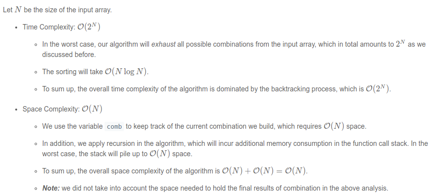


### [54. Spiral Matrix](https://leetcode.com/problems/spiral-matrix/)

Hanfei

Original thoughts

- flatten array
- for array 1-9, it has pattern 1,2,3,4 -> 4+4, 9,10,11 -> 12
- marked visited as -1

Correct solution

```java
public List<Integer> spiralOrder(int[][] matrix) {
        int VISITED = 101;
        int rows = matrix.length;
        int columns = matrix[0].length;
        // Four directions that we will move: right, down, left, up.
        int[][] directions = {{0, 1}, {1, 0}, {0, -1}, {-1, 0}};
        // Initial direction: moving right.
        int currentDirection = 0;
        // The number of times we change the direction.
        int changeDirection = 0;
        // Current place that we are at is (row, col).
        // row is the row index; col is the column index.
        int row = 0;
        int col = 0;
        // Store the first element and mark it as visited.
        List<Integer> result = new ArrayList<>();
        result.add(matrix[0][0]);
        matrix[0][0] = VISITED;
        while (changeDirection < 2) {
            while (row + directions[currentDirection][0] >= 0 &&
                   row + directions[currentDirection][0] < rows &&
                   col + directions[currentDirection][1] >= 0 &&
                   col + directions[currentDirection][1] < columns &&
                   matrix[row + directions[currentDirection][0]]
                   [col + directions[currentDirection][1]] != VISITED) {
                // Reset this to 0 since we did not break and change the direction.
                changeDirection = 0;
                // Calculate the next place that we will move to.
                row = row + directions[currentDirection][0];
                col = col + directions[currentDirection][1];
                result.add(matrix[row][col]);
                matrix[row][col] = VISITED;
            }
            // Change our direction.
            currentDirection = (currentDirection + 1) % 4;
            // Increment change_direction because we changed our direction.
            changeDirection++;
        }
        return result;
    }
```

Analysis

- Time O(M*N) iterate each element once
- Space O(1), didn't use other space

Modified solution

- reference spiral solution 2 

```java
class Solution {
    public List<Integer> spiralOrder(int[][] matrix) {
        int size = matrix.length * matrix[0].length;
        int visited = -101;
        List<Integer> result = new ArrayList<>();
        int cnt = 1;
        int dir[][] = {{0, 1}, {1, 0}, {0, -1}, {-1, 0}};
        int d = 0;
        int row = 0;
        int col = 0;
       
      
        while (cnt <= size) {
            if(matrix[row][col] != visited){  // stop condition
                result.add(matrix[row][col]);
                matrix[row][col] = visited;
                int r = Math.floorMod(row + dir[d][0], matrix.length);
                int c = Math.floorMod(col + dir[d][1], matrix[0].length);

                // change direction if next cell is non zero
                if (matrix[r][c] == visited) d = (d + 1) % 4;

                row += dir[d][0];
                col += dir[d][1];
            }
            
            cnt++;
        } 
        return result;
    }
}
```


### [55. Jump Game](https://leetcode.com/problems/jump-game/)

Hanfei

Original solution (incorrect) --> dead end

```java
    public boolean canJump(int[] nums) {
        int jumpIndex = 1;
        boolean firstRound  = true;
        int beforeSum = -1;
        int count = 0;
        while(jumpIndex < nums.length && jumpIndex >= 0){
            
            if(jumpIndex == nums.length - 1)
                return true;
            if(beforeSum == jumpIndex){
                 count++;
                if(count > 2)
                    break;
            } else {
                beforeSum = jumpIndex;
            }
               

            int jumpInterval = nums[jumpIndex];
            
           jumpIndex += jumpInterval;
            
        }
        return jumpIndex == nums.length;
    }
```


Recommended solution:

- Backtracking (most inefficient)

  ```java
      public boolean canJumpToNext(int position, int [] nums){
          if(position == nums.length - 1){
              return true;
          }
          
          int furtherJump = Math.min(position + nums[position], nums.length - 1);
          for (int next = furthestJump; nextPosition > position; nextPosition--){
              if(canJumpToNext(next, nums)){
                  return true;
              }
          }
          return false;
      }
      public boolean canJump(int[] nums) {
  
          return canJumpToNext(0,nums);
      }
  ```

- Dynamic programming (with mem)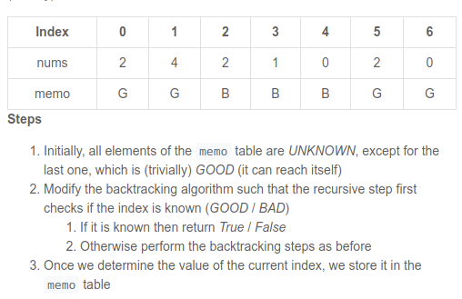

  ```java
  enum Index {
      GOOD, BAD, UNKNOWN
  } // new added
  
  
  class Solution {
      Index[] memo;
      
      public boolean canJumpToNext(int position, int [] nums){
          if (memo[position] != Index.UNKNOWN) {
              return memo[position] == Index.GOOD ? true : false;
          } // new added
          
          int furtherJump = Math.min(position + nums[position], nums.length - 1);
          for (int next = furtherJump; next > position; next--){
              if(canJumpToNext(next, nums)){
                  memo[position] = Index.GOOD; // new added
                  return true;
              } 
          }
          memo[position] = Index.BAD; // new added
          return false;
      }
      public boolean canJump(int[] nums) {
          memo = new Index[nums.length];// new added
          for (int i = 0; i < memo.length; i++) {
              memo[i] = Index.UNKNOWN;
          }// new added
          memo[memo.length - 1] = Index.GOOD; // new added
          return canJumpToNext(0,nums);
      }
  }
  ```

  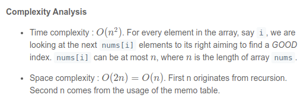

- greedy (most efficient)

  ```java
  public class Solution {
      public boolean canJump(int[] nums) {
          int lastPos = nums.length - 1;
          for (int i = nums.length - 1; i >= 0; i--) {
              if (i + nums[i] >= lastPos) {
                  lastPos = i;
              }
          }
          return lastPos == 0;
      }
  }
  ```

  Time: O(n)

  Space O(1)

### [56. Merge Intervals](https://leetcode.com/problems/merge-intervals/)

Hanfei

Original thoughts:

- sort array of interval by first element

- look to extend interval

  ```java
  class Solution {
      public int[][] merge(int[][] intervals) {
          Arrays.sort(intervals, (a,b) -> Integer.compare(a[0],b[0]));
          LinkedList<int[]> merged = new LinkedList<>();
          
          for(int [] invterval: intervals){
              if(merged.isEmpty()){
                  merged.add(invterval);
                  continue;
              }
              
              
              
              if(merged.getLast()[1] >= invterval[0] ){
                  merged.getLast()[1] = Math.max(invterval[1],merged.getLast()[1]);
              } else {
                  merged.add(invterval);
              }
          }
          
          return merged.toArray(new int[merged.size()][]);
      }
  }
  ```

  Time: O(NlogN)  most of sort takes this time

  Space = O(N)

### [57. Insert Interval](https://leetcode.com/problems/insert-interval/)

Hanfei

original solution:

- tweak merge interval a little bit

  - failed tested case 
    - [[1,5]]
      [0,3]

  ```java
  class Solution {
      public int[][] insert(int[][] intervals, int[] newInterval) {
          LinkedList<int[]> merged = new LinkedList<>();
          boolean notfound = true;
          boolean firstTime = true;
          for(int [] invterval: intervals){
              if(merged.isEmpty()){
                  merged.add(invterval);
          
              }
              
              if(merged.getLast()[0] <= newInterval[0] &&newInterval[0] <= merged.getLast()[1] && notfound){
                   merged.getLast()[1] = Math.max(merged.getLast()[1],newInterval[1]);
                   notfound = false;
              } 
              
  
              
              if(merged.getLast()[1] >= invterval[0] ){
                  merged.getLast()[1] = Math.max(invterval[1],merged.getLast()[1]);
              } else {
                  merged.add(invterval);
              }
          }
          
          if(notfound){
                  merged.add(newInterval);
              }
          
          return merged.toArray(new int[merged.size()][]);
      }
  }
  ```

  correct solution

  ```java
    public int[][] insert(int[][] intervals, int[] newInterval) {
      // init data
      int newStart = newInterval[0], newEnd = newInterval[1];
      int idx = 0, n = intervals.length;
      LinkedList<int[]> output = new LinkedList<int[]>();
  
      // add all intervals starting before newInterval
      while (idx < n && newStart > intervals[idx][0])
        output.add(intervals[idx++]);
  
      // add newInterval
      int[] interval = new int[2];
      // if there is no overlap, just add the interval
      if (output.isEmpty() || output.getLast()[1] < newStart)
        output.add(newInterval);
      // if there is an overlap, merge with the last interval
      else {
        interval = output.removeLast();
        interval[1] = Math.max(interval[1], newEnd);
        output.add(interval);
      }
  
      // add next intervals, merge with newInterval if needed
      while (idx < n) {
        interval = intervals[idx++];
        int start = interval[0], end = interval[1];
        // if there is no overlap, just add an interval
        if (output.getLast()[1] < start) output.add(interval);
        // if there is an overlap, merge with the last interval
        else {
          interval = output.removeLast();
          interval[1] = Math.max(interval[1], end);
          output.add(interval);
        }
      }
      return output.toArray(new int[output.size()][2]);
    }
  ```

  Time: O(N)

  Space: O(N)

### 35.[Search Insert Position](https://leetcode.com/problems/search-insert-position)

Hanfei:

Original thoughts:

- binary search

  - take care of the left side of interval

    ```java
    class Solution {
        public int searchInsert(int[] nums, int target) {
            
            int left = 0;
            int right = nums.length - 1;
            int result = 0;
            if(nums.length == 1){
                return nums[0] >= target? 0 : 1;
            }
            while(left < right){
                int pivot = (left + right) / 2;
                if(nums[pivot] == target){
                    return pivot;
                }
                
                if(nums[left] >= target){
                     result = left;
                } else if(nums[right] < target){
                  result = right + 1;
                } else {
                     result = nums[pivot] > target ? pivot : pivot + 1;
                }
                
                if(nums[pivot] > target){
                    right = pivot - 1;
                } else {
                    left = pivot + 1;
                }    
            }
            
            return result;
            
        }
    }
    ```


Simplified solution:

```java
class Solution {
  public int searchInsert(int[] nums, int target) {
    int pivot, left = 0, right = nums.length - 1;
    while (left <= right) {
      pivot = left + (right - left) / 2;
      if (nums[pivot] == target) return pivot;
      if (target < nums[pivot]) right = pivot - 1;
      else left = pivot + 1;
    }
    return left;
  }
}
```


### 36.[Valid Sudoku](https://leetcode.com/problems/valid-sudoku)

Hanfei:

Original thoughts:

- use back tracking / dynamic programming
- difficulties: how to use enforce grid search?


suggested solution

> 1.see java lambda expression:https://blog.csdn.net/qq_31635851/article/details/116593033
>
> IntFunction 

> 2. all match example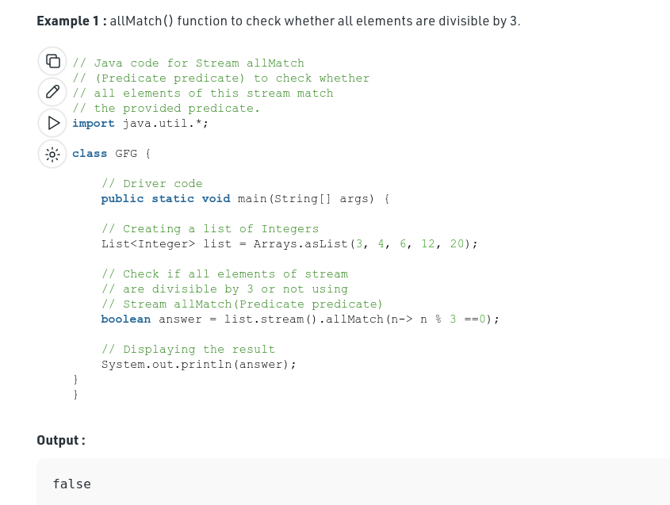

```java
class Solution {
    private final char EMPTY = '.';
        public boolean isValidSudoku(char[][] A) {
        for (int i = 0; i < 9; i++) {
            final int pos = i;
            if (!isValid(x -> A[pos][x])) return false;
            if (!isValid(x -> A[x][pos])) return false;
            if (!isValid(x -> A[(pos / 3) * 3 + x / 3][(pos % 3) * 3 + x % 3])) return false;
        }
        return true;
    }

    private boolean isValid(IntFunction<Character> a) {
        Set<Character> set = new HashSet<>();
        return IntStream.range(0, 9).allMatch(x -> a.apply(x) == '.' || set.add(a.apply(x))); // duplicate value will return false when set
    }
}

```

optimal solution (use bit-wise operation)

```java
class Solution {
    public boolean isValidSudoku(char[][] board) {
        int N = 9;

        // Use a binary number to record previous occurrence
        int[] rows = new int[N];
        int[] cols = new int[N];
        int[] boxes = new int[N];

        for (int r = 0; r < N; r++) {
            for (int c = 0; c < N; c++) {
                // Check if the position is filled with number
                if (board[r][c] == '.') {
                    continue;
                }
                int val = board[r][c] - '0';
                int pos = 1 << (val - 1);

                // Check the row
                if ((rows[r] & pos) > 0) {
                    return false;
                }
                rows[r] |= pos;

                // Check the column
                if ((cols[c] & pos) > 0) {
                    return false;
                }
                cols[c] |= pos;

                // Check the box
                int idx = (r / 3) * 3 + c / 3;
                if ((boxes[idx] & pos) > 0) {
                    return false;
                }
                boxes[idx] |= pos;
            }
        }
        return true;
    }
}
```

Time O(N^2)

Space O(N)

### 45.[Jump Game II](https://leetcode.com/problems/jump-game-ii)

Hanfei:

Original thoughts:

- greedy algorithm

  - difficulties: we don't know the future of the array.
  - solution: iterate each item and find the furthest one 

  ```java
  class Solution {
      public int jump(int[] nums) {
          int counter = 0;
          int farthest = 0;
          int currentEnd = 0;
          for(int i = 0; i < nums.length -1;i++){
              farthest = Math.max(farthest, i + nums[i]);
              
              if(i == currentEnd){
                  counter++;
                  currentEnd = farthest;
              }
          }
          
          return counter;
      }
  }
  ```

  Time: O(N)

  Space O(1)

### 46.[Permutations](https://leetcode.com/problems/permutations)

Hanfei

Original thoughts

- brute force

- backtrack

  ```java
  class Solution {
      List<List<Integer>> result = new ArrayList<>();
      public void backTrace(List<List<Integer>>  result, List<Integer> comb, int[] nums, int start){
          if(nums.length == start){
              result.add(comb);
              
              return;
          }
          
          for(int i = start; i < nums.length; i++){
              comb.add(nums[i]);
              
              backTrace(result, comb,nums, i+1);
              comb = new ArrayList<>();
           }
          
      }
      
      
      public List<List<Integer>> permute(int[] nums) {
          
          backTrace(result, new ArrayList<>(), nums, 0);
          return result;
          
      }
  }
  ```

Correct solution

- backtrack change the function

  ```java
  class Solution {
      
      public void backTrace(List<List<Integer>>  result, List<Integer> comb, int[] nums, int start){
          if(nums.length == start){
              result.add(new ArrayList<Integer>(comb));
              
              return;
          }
          
          for(int i = start; i < nums.length; i++){
              Collections.swap(comb, start, i);
              
              backTrace(result, comb,nums, start+1);
              
              Collections.swap(comb, i, start);
              
           }
          
      }
      
      
      public List<List<Integer>> permute(int[] nums) {
          ArrayList<Integer> nums_lst = new ArrayList<Integer>();
      for (int num : nums){
           nums_lst.add(num);
      }
       List<List<Integer>> result = new ArrayList<>();
          backTrace(result, nums_lst, nums, 0);
          return result;
          
      }
  }
  ```

  Analysis

  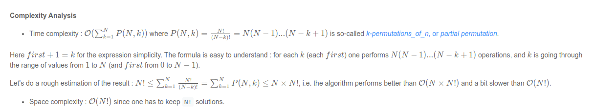

### 47.[Permutations II](https://leetcode.com/problems/permutations-ii)

Hanfei

original thoughts 

- backtrack

  ```java
  class Solution {
      HashSet <List<Integer>> set = new HashSet<>();
      public List<List<Integer>> permuteUnique(int[] nums) {
          boolean used[] = new boolean[nums.length];
          permute(new ArrayList<Integer>(),nums, used);
          return new ArrayList(set);
      }
      
      public void permute(List<Integer> permutation, int []nums,  boolean used[]){
                  
          if(permutation.size() == nums.length){
              set.add(new ArrayList<Integer>(permutation));
              return;
          }
  
          for(int i = 0; i < nums.length; i++){
              if(!used[i]){
                  permutation.add(nums[i]);
                  used[i] = true;
                  permute(permutation, nums, used);
                  permutation.remove(permutation.size()-1);
                  used[i] =false;
              }
  
          }
          
      }
  }
  ```

better solution

```java
class Solution {

    public List<List<Integer>> permuteUnique(int[] nums) {
        List<List<Integer>> results = new ArrayList<>();

        // count the occurrence of each number
        HashMap<Integer, Integer> counter = new HashMap<>();
        for (int num : nums) {
            if (!counter.containsKey(num))
                counter.put(num, 0);
            counter.put(num, counter.get(num) + 1);
        }

        LinkedList<Integer> comb = new LinkedList<>();
        this.backtrack(comb, nums.length, counter, results);
        return results;
    }

    protected void backtrack(
            LinkedList<Integer> comb,
            Integer N,
            HashMap<Integer, Integer> counter,
            List<List<Integer>> results) {

        if (comb.size() == N) {
            // make a deep copy of the resulting permutation,
            // since the permutation would be backtracked later.
            results.add(new ArrayList<Integer>(comb));
            return;
        }

        for (Map.Entry<Integer, Integer> entry : counter.entrySet()) {
            Integer num = entry.getKey();
            Integer count = entry.getValue();
            if (count == 0)
                continue;
            // add this number into the current combination
            comb.addLast(num);
            counter.put(num, count - 1);

            // continue the exploration
            backtrack(comb, N, counter, results);

            // revert the choice for the next exploration
            comb.removeLast();
            counter.put(num, count);
        }
    }
}
```

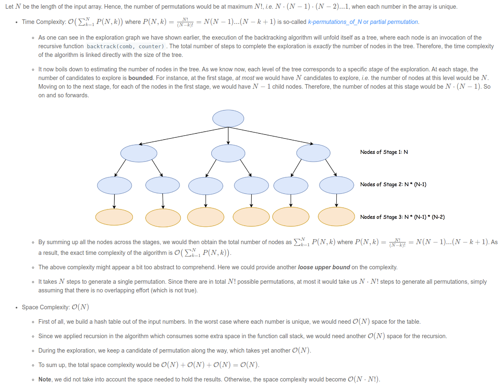

### 48.[Rotate Image](https://leetcode.com/problems/rotate-image)

Hanfei 

correct solution

```java
class Solution {
    public void rotate(int[][] matrix) {
        int n = matrix.length;
        for (int i = 0; i < (n + 1) / 2; i ++) {
            for (int j = 0; j < n / 2; j++) {
                int temp = matrix[n - 1 - j][i];
                matrix[n - 1 - j][i] = matrix[n - 1 - i][n - j - 1];
                matrix[n - 1 - i][n - j - 1] = matrix[j][n - 1 -i];
                matrix[j][n - 1 - i] = matrix[i][j];
                matrix[i][j] = temp;
            }
        }
    }
}
```

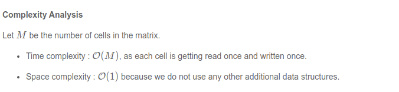


## 09-13 ~ 09 - 19

### 53.[Maximum Subarray](https://leetcode.com/problems/maximum-subarray)

Hanfei

Original thoughts (correct answer)

- Dynamic programming

  - keep a max value all the time, and a current sum

    ```java
    class Solution {
        public int maxSubArray(int[] nums) {
         
            int maxSum =  -1000000;
            int currentSum = 0;
            for(int i = 0; i < nums.length;i++){
                if(nums[i] > currentSum + nums[i]){
                    currentSum = nums[i];    
                } else {
                    currentSum +=  nums[i];
                }
                
                maxSum = Math.max(maxSum, currentSum);
                
            
            }
            
            return  maxSum;
        }
    }
    ```

    Time: O(N)

    Space O(1)

Reference solution:

DP

```java
class Solution {
    public int maxSubArray(int[] nums) {
        // Initialize our variables using the first element.
        int currentSubarray = nums[0];
        int maxSubarray = nums[0];
        
        // Start with the 2nd element since we already used the first one.
        for (int i = 1; i < nums.length; i++) {
            int num = nums[i];
            // If current_subarray is negative, throw it away. Otherwise, keep adding to it.
            currentSubarray = Math.max(num, currentSubarray + num);
            maxSubarray = Math.max(maxSubarray, currentSubarray);
        }
        
        return maxSubarray;
    }
}
```

Divide and conquer

```java
class Solution {
    private int[] numsArray;
    
    public int maxSubArray(int[] nums) {
        numsArray = nums;
        
        // Our helper function is designed to solve this problem for
        // any array - so just call it using the entire input!
        return findBestSubarray(0, numsArray.length - 1);
    }
    
    private int findBestSubarray(int left, int right) {
        // Base case - empty array.
        if (left > right) {
            return Integer.MIN_VALUE;
        }
        
        int mid = Math.floorDiv(left + right, 2);
        int curr = 0;
        int bestLeftSum = 0;
        int bestRightSum = 0;
        
        // Iterate from the middle to the beginning.
        for (int i = mid - 1; i >= left; i--) {
            curr += numsArray[i];
            bestLeftSum = Math.max(bestLeftSum, curr);
        }
        
        // Reset curr and iterate from the middle to the end.
        curr = 0;
        for (int i = mid + 1; i <= right; i++) {
            curr += numsArray[i];
            bestRightSum = Math.max(bestRightSum, curr);
        }
        
        // The bestCombinedSum uses the middle element and the best
        // possible sum from each half.
        int bestCombinedSum = numsArray[mid] + bestLeftSum + bestRightSum;
        
        // Find the best subarray possible from both halves.
        int leftHalf = findBestSubarray(left, mid - 1);
        int rightHalf = findBestSubarray(mid + 1, right);
        
        // The largest of the 3 is the answer for any given input array.
        return Math.max(bestCombinedSum, Math.max(leftHalf, rightHalf));
    }
}

```


### 59.[Spiral Matrix II](https://leetcode.com/problems/spiral-matrix-ii) :star:

Hanfei

Original thoughts

- modify spiral matrix solution

```java
class Solution {
    public int[][] generateMatrix(int n) {
        
        int UNVISITED = -1;
        int [][] matrix = new int [n][n];
        
        int rows = n;
        int columns = n;
       
        int[][] directions = {{0, 1}, {1, 0}, {0, -1}, {-1, 0}};
      
        int currentDirection = 0;
        
        int changeDirection = 0;
       
        int row = 0;
        int col = 0;
        
        List<Integer> result = new ArrayList<>();
        for(int i = 0; i < n; i++){
            for(int j = 0; j < n; j++){
                matrix[i][j] = UNVISITED;
            }
        }
        matrix[0][0] = 1;
        int i = 2;
        while (changeDirection < 2) {
           
            while (row + directions[currentDirection][0] >= 0 &&
                   row + directions[currentDirection][0] < rows &&
                   col + directions[currentDirection][1] >= 0 &&
                   col + directions[currentDirection][1] < columns &&
                   matrix[row + directions[currentDirection][0]]
                   [col + directions[currentDirection][1]] == UNVISITED) {
                // Reset this to 0 since we did not break and change the direction.
                changeDirection = 0;
                // Calculate the next place that we will move to.
                row = row + directions[currentDirection][0];
                col = col + directions[currentDirection][1];
             
                matrix[row][col] = i++;

            }
      
            // Change our direction.
            currentDirection = (currentDirection + 1) % 4;
            // Increment change_direction because we changed our direction.
            changeDirection++;
        }
        return matrix;
        
    }
}
```

Time: O(N^2)

Space: O(N)


Simplified solution

> FloorMod example
>
> 
>
> 

```java
class Solution {
    public int[][] generateMatrix(int n) {
        int[][] result = new int[n][n];
        int cnt = 1;
        int dir[][] = {{0, 1}, {1, 0}, {0, -1}, {-1, 0}};
        int d = 0;
        int row = 0;
        int col = 0;
        while (cnt <= n * n) {
            result[row][col] = cnt++;
            int r = Math.floorMod(row + dir[d][0], n);
            int c = Math.floorMod(col + dir[d][1], n);

            // change direction if next cell is non zero
            if (result[r][c] != 0) d = (d + 1) % 4;

            row += dir[d][0];
            col += dir[d][1];
        }
        return result;
    }
}
```


### 63.[Unique Paths II](https://leetcode.com/problems/unique-paths-ii) :star:

Hanfei 

- Thoughts
  - Dynamic programming

Correct solution

```java
class Solution {
    public int uniquePathsWithObstacles(int[][] obstacleGrid) {

        int R = obstacleGrid.length;
        int C = obstacleGrid[0].length;

        // If the starting cell has an obstacle, then simply return as there would be
        // no paths to the destination.
        if (obstacleGrid[0][0] == 1) {
            return 0;
        }

        // Number of ways of reaching the starting cell = 1.
        obstacleGrid[0][0] = 1;

        // Filling the values for the first column
        for (int i = 1; i < R; i++) {
            obstacleGrid[i][0] = (obstacleGrid[i][0] == 0 && obstacleGrid[i - 1][0] == 1) ? 1 : 0;
        }

        // Filling the values for the first row
        for (int i = 1; i < C; i++) {
            obstacleGrid[0][i] = (obstacleGrid[0][i] == 0 && obstacleGrid[0][i - 1] == 1) ? 1 : 0;
        }

        // Starting from cell(1,1) fill up the values
        // No. of ways of reaching cell[i][j] = cell[i - 1][j] + cell[i][j - 1]
        // i.e. From above and left.
        for (int i = 1; i < R; i++) {
            for (int j = 1; j < C; j++) {
                if (obstacleGrid[i][j] == 0) {
                    obstacleGrid[i][j] = obstacleGrid[i - 1][j] + obstacleGrid[i][j - 1];
                } else {
                    obstacleGrid[i][j] = 0;
                }
            }
        }

        // Return value stored in rightmost bottommost cell. That is the destination.
        return obstacleGrid[R - 1][C - 1];
    }
}
```


### 64.[ Minimum Path Sum](https://leetcode.com/problems/minimum-path-sum)

Original thoughts 

- Dynamic programming


Correct solution

```java
public class Solution {
    public int minPathSum(int[][] grid) {
        for (int i = grid.length - 1; i >= 0; i--) {
            for (int j = grid[0].length - 1; j >= 0; j--) {
                if(i == grid.length - 1 && j != grid[0].length - 1)
                    grid[i][j] = grid[i][j] +  grid[i][j + 1];
                else if(j == grid[0].length - 1 && i != grid.length - 1)
                    grid[i][j] = grid[i][j] + grid[i + 1][j];
                else if(j != grid[0].length - 1 && i != grid.length - 1)
                    grid[i][j] = grid[i][j] + Math.min(grid[i + 1][j],grid[i][j + 1]);
            }
        }
        return grid[0][0];
    }
}
```

Time O(mn)

Space O(1)

### 66.[Plus One](https://leetcode.com/problems/plus-one)

Hanfei

Original thoughts (correct)

- using carry 

```java
class Solution {
    public int[] plusOne(int[] digits) {
        int carry = 0;
        boolean first = true;
        for(int i = digits.length - 1; i >= 0; i--){
            int nextDigit = digits[i] + carry;
            if(first){
                nextDigit += 1;
                first = false;
            }
            carry = nextDigit /  10 > 0 ? 1 : 0;
            
            digits[i] = nextDigit %  10;
            if(carry == 0)
                break;
            
        }
        if(carry > 0){
            int [] result = new int [digits.length + 1];
            
            result = Arrays.copyOfRange(digits, 0, digits.length+1);
            result[0] = 1;
            return result;
        }
        
        return digits;
    }
}
```

Time O(N)

Space O(N)

Reference solution

```java
class Solution {
  public int[] plusOne(int[] digits) {
    int n = digits.length;

    // move along the input array starting from the end
    for (int idx = n - 1; idx >= 0; --idx) {
      // set all the nines at the end of array to zeros
      if (digits[idx] == 9) {
        digits[idx] = 0;
      }
      // here we have the rightmost not-nine
      else {
        // increase this rightmost not-nine by 1
        digits[idx]++;
        // and the job is done
        return digits;
      }
    }
    // we're here because all the digits are nines
    digits = new int[n + 1];
    digits[0] = 1;
    return digits;
  }
}
```


### 73.[Set Matrix Zeroes](https://leetcode.com/problems/set-matrix-zeroes)

Hanfei

Original thoughts

- Dynamic programming

```java
class Solution {
  public void setZeroes(int[][] matrix) {
    Boolean isCol = false;
    int R = matrix.length;
    int C = matrix[0].length;

    for (int i = 0; i < R; i++) {

      // Since first cell for both first row and first column is the same i.e. matrix[0][0]
      // We can use an additional variable for either the first row/column.
      // For this solution we are using an additional variable for the first column
      // and using matrix[0][0] for the first row.
      if (matrix[i][0] == 0) {
        isCol = true;
      }

      for (int j = 1; j < C; j++) {
        // If an element is zero, we set the first element of the corresponding row and column to 0
        if (matrix[i][j] == 0) {
          matrix[0][j] = 0;
          matrix[i][0] = 0;
        }
      }
    }

    // Iterate over the array once again and using the first row and first column, update the elements.
    for (int i = 1; i < R; i++) {
      for (int j = 1; j < C; j++) {
        if (matrix[i][0] == 0 || matrix[0][j] == 0) {
          matrix[i][j] = 0;
        }
      }
    }

    // See if the first row needs to be set to zero as well
    if (matrix[0][0] == 0) {
      for (int j = 0; j < C; j++) {
        matrix[0][j] = 0;
      }
    }

    // See if the first column needs to be set to zero as well
    if (isCol) {
      for (int i = 0; i < R; i++) {
        matrix[i][0] = 0;
      }
    }
  }
}
```

Time O(MN)

Space O(1)

### 74.[Search a 2D Matrix](https://leetcode.com/problems/search-a-2d-matrix)

Hanfei

- Original thoughts (correct)

  - Binary search + matrix search

    ```java
    class Solution {
        
        public boolean binarySearch(int nums[], int target){
            int left = 0;
            int right = nums.length - 1;
            
            while(left <= right){ //notice must be <=, else it wont pass case like signle element, e.g nums = [1]
                int pivot = (left + right) / 2;
                if(nums[pivot] == target){
                    return true;
                }
                
                if(nums[pivot] < target){
                    left = pivot + 1;
                } else {
                    right = pivot - 1;
                }
                
                
            }
            
            return false;
        }
        
        public boolean searchMatrix(int[][] matrix, int target) {
            
            for(int i = 0; i < matrix.length ; i++){
                
                if(matrix[i][0] <= target && matrix[i][matrix[i].length -1] >= target){
                    if(binarySearch(matrix[i], target)){
                    return true;
                    }
                }
            }
            
            return false;
        }
    }
    ```

    Time: O(logMN)

    Space O(1)

### 75.[Sort Colors](https://leetcode.com/problems/sort-colors)

Hanfei

Original thoughts

- implement compare sort or other sort

correct solution

-  [Dutch National Flag Problem](https://en.wikipedia.org/wiki/Dutch_national_flag_problem)

```java
class Solution {
  /*
  Dutch National Flag problem solution.
  */
  public void sortColors(int[] nums) {
    // for all idx < i : nums[idx < i] = 0
    // j is an index of element under consideration
    int p0 = 0, curr = 0;
    // for all idx > k : nums[idx > k] = 2
    int p2 = nums.length - 1;

    int tmp;
    while (curr <= p2) {
      if (nums[curr] == 0) {
        // swap p0-th and curr-th elements
        // i++ and j++
        tmp = nums[p0];
        nums[p0++] = nums[curr];
        nums[curr++] = tmp;
      }
      else if (nums[curr] == 2) {
        // swap k-th and curr-th elements
        // p2--
        tmp = nums[curr];
        nums[curr] = nums[p2];
        nums[p2--] = tmp;
      }
      else curr++;
    }
  }
}
```

Time O(N)

Space O(1)

### 77.[Combinations](https://leetcode.com/problems/combinations)

Hanfei 

Original thoughts

- backtrack

  - iterate through each combinations

    ```java
    class Solution {
      List<List<Integer>> output = new LinkedList();
      int n;
      int k;
    
      public void backtrack(int first, LinkedList<Integer> curr) {
        // if the combination is done
        if (curr.size() == k)
          output.add(new LinkedList(curr));
    
        for (int i = first; i < n + 1; ++i) {
          // add i into the current combination
          curr.add(i);
          // use next integers to complete the combination
          backtrack(i + 1, curr);
          // backtrack
          curr.removeLast();
        }
      }
    
      public List<List<Integer>> combine(int n, int k) {
        this.n = n;
        this.k = k;
        backtrack(1, new LinkedList<Integer>());
        return output;
      }
    }
    ```

    

### 78.[ Subsets](https://leetcode.com/problems/subsets)

Hanfei

Original thoughts:

- simple back track

  ```java
  class Solution {
      
      List<List<Integer>> result = new ArrayList<>();
      
      public void backTrack(int [] nums, int start, List<Integer> combs){
          
          if(combs.size() == nums.length){
              result.add(new ArrayList<>(combs));
              return;
          }
          
          result.add(new ArrayList<>(combs));
          
          for(int i = start; i < nums.length ; i ++){
              
              combs.add(nums[i]);
              backTrack(nums, i+1, combs);
              combs.remove(combs.size() - 1);
          }
          
      }
          
          
          
          
      public List<List<Integer>> subsets(int[] nums) {
           backTrack(nums,0, new ArrayList<>());
          return result;
      }
  }
  ```

  Time: O(N!) traverse all the possible combinations tree

  Space: O(N!) hold all possible combinations

Improved solution (In both time & space)

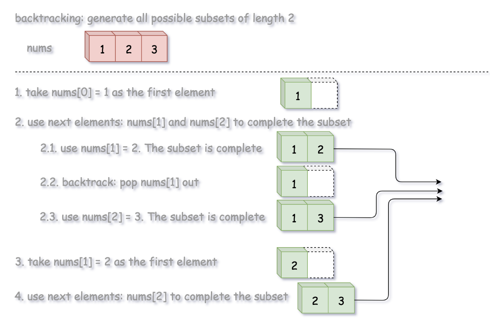

```java
class Solution {
  List<List<Integer>> output = new ArrayList();
  int n, k;

  public void backtrack(int first, ArrayList<Integer> curr, int[] nums) {
    // if the combination is done
    if (curr.size() == k) {
      output.add(new ArrayList(curr));
      return;
    }
    for (int i = first; i < n; ++i) {
      // add i into the current combination
      curr.add(nums[i]);
      // use next integers to complete the combination
      backtrack(i + 1, curr, nums);
      // backtrack
      curr.remove(curr.size() - 1);
    }
  }

  public List<List<Integer>> subsets(int[] nums) {
    n = nums.length;
    for (k = 0; k < n + 1; ++k) {
      backtrack(0, new ArrayList<Integer>(), nums);
    }
    return output;
  }
}
```

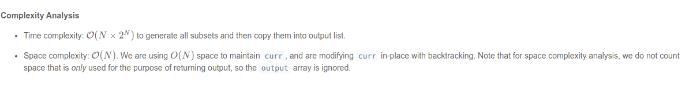

Bitwise

```java
class Solution {
  public List<List<Integer>> subsets(int[] nums) {
    List<List<Integer>> output = new ArrayList();
    int n = nums.length;

    for (int i = (int)Math.pow(2, n); i < (int)Math.pow(2, n + 1); ++i) {
      // generate bitmask, from 0..00 to 1..11
      String bitmask = Integer.toBinaryString(i).substring(1);

      // append subset corresponding to that bitmask
      List<Integer> curr = new ArrayList();
      for (int j = 0; j < n; ++j) {
        if (bitmask.charAt(j) == '1') curr.add(nums[j]);
      }
      output.add(curr);
    }
    return output;
  }
}
```

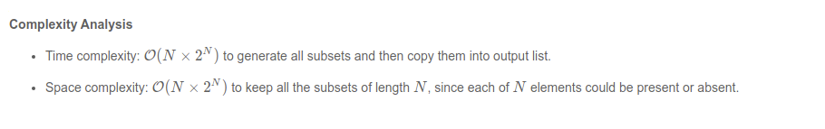

### 79.[ Word Search](https://leetcode.com/problems/word-search)

Hanfei

Original thoughts:

- back tracking

```java
class Solution {
     char[][] board;
    public boolean backTrack(int row, int col, String word, int start){
        
        if(start == word.length()){
            return true;
        }
        
        if(row >= board.length || col >= board[0].length ||
          row < 0 || col < 0 || word.charAt(start) != board[row][col] ){
            return false;
        }
        
        
        this.board[row][col] = '#';
        
        int [] rowOffset = {0,1,0, -1};
        int [] colOffset = {1,0,-1,0};
        
        //additionall setting
        boolean ret = false;
        
        for(int d = 0; d < 4;d++){
            
            ret = backTrack(row + rowOffset[d], col + colOffset[d],word,start+1);
            if(ret)
                break;
            
        }
        //restore setting
        this.board[row][col] = word.charAt(start);
        return ret;
            
            
        
    }
    
    public boolean exist(char[][] board, String word) {
        this.board = board;
        
        for(int i = 0; i < board.length;i++){
            for(int j = 0; j < board[0].length;j++){
                if(backTrack(i,j,word,0))
                    return true;
            }
        }
        
        return false;
    }
}
```

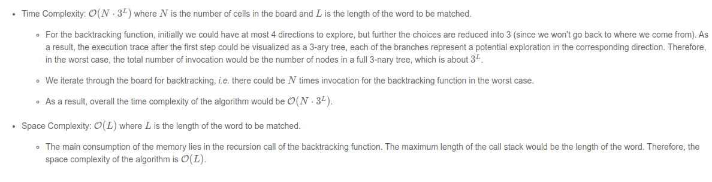

Note the time complexity is 3^L, since the we cannot go back after first choice (marked as #)

### 80.[Remove Duplicates from Sorted Array II](https://leetcode.com/problems/remove-duplicates-from-sorted-array-ii)

Hanfei

Original thoughts

- keep a counter and remove duplicate element if necessary

Correct solution

```java
class Solution {
    
    public int[] remElement(int[] arr, int index) {
        
        //
        // Overwrite the element at the given index by 
        // moving all the elements to the right of the
        // index, one position to the left.
        //
        for (int i = index + 1; i < arr.length; i++) {
            arr[i - 1] = arr[i];
        }
        
        return arr;
    }    
    
    public int removeDuplicates(int[] nums) {
        
        // Initialize the counter and the array index.
        int i = 1, count = 1, length = nums.length;
        
        //
        // Start from the second element of the array and process
        // elements one by one.
        //
        while (i < length) {
            
            //
            // If the current element is a duplicate, 
            // increment the count.
            //
            if (nums[i] == nums[i - 1]) {
                
                count++;
                
                //    
                // If the count is more than 2, this is an unwanted duplicate element
                // and hence we remove it from the array.
                //    
                if (count > 2) {
                    
                    this.remElement(nums, i);
                    
                    i--;
                    

                    length--;
                }
            } else {
                
                count = 1;
            }
      
            i++;
        }
            
        return length;
    }
}
```

Time: O(N^2)

Space O(1)

### 81 [Search in Rotated Sorted Array II](https://leetcode.com/problems/search-in-rotated-sorted-array-ii) :star:

Hanfei

Original thoughts

- tweak search rotate array 1
- difficulties: multiple pivot

Correct solution

```java
class Solution {
    public boolean search(int[] nums, int target) {
        int n = nums.length;
        if (n == 0) return false;
        int end = n - 1;
        int start = 0;

        while (start <= end) {
            int mid = start + (end - start) / 2;

            if (nums[mid] == target) {
                return true;
            }

            if (!isBinarySearchHelpful(nums, start, nums[mid])) {
                start++;
                continue;
            }
            // which array does pivot belong to.
            boolean pivotArray = existsInFirst(nums, start, nums[mid]);

            // which array does target belong to.
            boolean targetArray = existsInFirst(nums, start, target);
            if (pivotArray ^ targetArray) { // If pivot and target exist in different sorted arrays, recall that xor is true when both operands are distinct
                if (pivotArray) {
                    start = mid + 1; // pivot in the first, target in the second
                } else {
                    end = mid - 1; // target in the first, pivot in the second
                }
            } else { // If pivot and target exist in same sorted array
                if (nums[mid] < target) {
                    start = mid + 1;
                } else {
                    end = mid - 1;
                }
            }
        }
        return false;
    }

    // returns true if we can reduce the search space in current binary search space
    private boolean isBinarySearchHelpful(int[] arr, int start, int element) {
        return arr[start] != element;
    }

    // returns true if element exists in first array, false if it exists in second
    private boolean existsInFirst(int[] arr, int start, int element) {
        return arr[start] <= element;
    }
}
```

Time O(log N)

Space O(1)

### 88. [Merge Sorted Array](https://leetcode.com/problems/merge-sorted-array)

Hanfei

Original thoughts

-  pointer strategy
-  Blocks: zero values

Correct solution

```java
class Solution {
    public void merge(int[] nums1, int m, int[] nums2, int n) {
        // Make a copy of the first m elements of nums1.
        int[] nums1Copy = new int[m];
        for (int i = 0; i < m; i++) {
            nums1Copy[i] = nums1[i];
        }

        // Read pointers for nums1Copy and nums2 respectively.
        int p1 = 0;
        int p2 = 0;
                
        // Compare elements from nums1Copy and nums2 and write the smallest to nums1.
        for (int p = 0; p < m + n; p++) {
            // We also need to ensure that p1 and p2 aren't over the boundaries
            // of their respective arrays.
            if (p2 >= n || (p1 < m && nums1Copy[p1] < nums2[p2])) {
                nums1[p] = nums1Copy[p1++];
            } else {
                nums1[p] = nums2[p2++];
            }
        }
    }
}
```

Time O(m + n)

Space O(m)

## 09-20 ~ 09-26

### 90.[Subsets II](https://leetcode.com/problems/subsets-ii)

Hanfei

Original thoughts

- backtrack

Correct solution

```java
class Solution {
    public List<List<Integer>> subsetsWithDup(int[] nums) {
        Arrays.sort(nums);
        List<List<Integer>> subsets = new ArrayList<>();
        List<Integer> currentSubset = new ArrayList<>();

        subsetsWithDupHelper(subsets, currentSubset, nums, 0);
        return subsets;
    }

    private void subsetsWithDupHelper(List<List<Integer>> subsets, List<Integer> currentSubset, int[] nums, int index) {
        // Add the subset formed so far to the subsets list.
        subsets.add(new ArrayList<>(currentSubset));

        for (int i = index; i < nums.length; i++) {
            // If the current element is a duplicate, ignore.
            if (i != index && nums[i] == nums[i - 1]) {
                continue;
            }
            currentSubset.add(nums[i]);
            subsetsWithDupHelper(subsets, currentSubset, nums, i + 1);
            currentSubset.remove(currentSubset.size() - 1);
        }
    }
}
```

Time O(N * 2^n)

Space O(N)

### 105.[Construct Binary Tree from Preorder and Inorder Traversal](https://leetcode.com/problems/construct-binary-tree-from-preorder-and-inorder-traversal) :star::star::star:

Hanfei

Thoughts:

Noting

Correct solution

```java
class Solution {
    int preorderIndex;
    Map<Integer, Integer> inorderIndexMap;
    public TreeNode buildTree(int[] preorder, int[] inorder) {
        preorderIndex = 0;
        // build a hashmap to store value -> its index relations
        inorderIndexMap = new HashMap<>();
        for (int i = 0; i < inorder.length; i++) {
            inorderIndexMap.put(inorder[i], i);
        }

        return arrayToTree(preorder, 0, preorder.length - 1);
    }

    private TreeNode arrayToTree(int[] preorder, int left, int right) {
        // if there are no elements to construct the tree
        if (left > right) return null;

        // select the preorder_index element as the root and increment it
        int rootValue = preorder[preorderIndex++];
        TreeNode root = new TreeNode(rootValue);

        // build left and right subtree
        // excluding inorderIndexMap[rootValue] element because it's the root
        root.left = arrayToTree(preorder, left, inorderIndexMap.get(rootValue) - 1);
        root.right = arrayToTree(preorder, inorderIndexMap.get(rootValue) + 1, right);
        return root;
    }
}
```

Time: O(N)

Space: O(N)


### 106.[Construct Binary Tree from Inorder and Postorder Traversal](https://leetcode.com/problems/construct-binary-tree-from-inorder-and-postorder-traversal) :star::star::star:

Hanfei 

No thoughts

```java
class Solution {
  int post_idx;
  int[] postorder;
  int[] inorder;
  HashMap<Integer, Integer> idx_map = new HashMap<Integer, Integer>();

  public TreeNode helper(int in_left, int in_right) {
    // if there is no elements to construct subtrees
    if (in_left > in_right)
      return null;

    // pick up post_idx element as a root
    int root_val = postorder[post_idx];
    TreeNode root = new TreeNode(root_val);

    // root splits inorder list
    // into left and right subtrees
    int index = idx_map.get(root_val);

    // recursion 
    post_idx--;
    // build right subtree
    root.right = helper(index + 1, in_right);
    // build left subtree
    root.left = helper(in_left, index - 1);
    return root;
  }

  public TreeNode buildTree(int[] inorder, int[] postorder) {
    this.postorder = postorder;
    this.inorder = inorder;
    // start from the last postorder element
    post_idx = postorder.length - 1;

    // build a hashmap value -> its index
    int idx = 0;
    for (Integer val : inorder)
      idx_map.put(val, idx++);
    return helper(0, inorder.length - 1);
  }
}
```


### 108.[Convert Sorted Array to Binary Search Tree](https://leetcode.com/problems/convert-sorted-array-to-binary-search-tree)

Hanfei

No thoughts:

Correct solution

```java
class Solution {
    int[] nums;

    public TreeNode helper(int left, int right) {
        if (left > right) return null;

        // always choose left middle node as a root
        int p = (left + right) / 2;

        // preorder traversal: node -> left -> right
        TreeNode root = new TreeNode(nums[p]);
        root.left = helper(left, p - 1);
        root.right = helper(p + 1, right);
        return root;
    }

    public TreeNode sortedArrayToBST(int[] nums) {
        this.nums = nums;
        return helper(0, nums.length - 1);
    }
}
```

Time O(N)

Space O(logN)

### 118.[Pascal's Triangle](https://leetcode.com/problems/pascals-triangle) :star:

Hanfei 

No thoughts

Correct solution

```java
class Solution {
    public List<List<Integer>> generate(int numRows) {
        List<List<Integer>> triangle = new ArrayList<List<Integer>>();

        // Base case; first row is always [1].
        triangle.add(new ArrayList<>());
        triangle.get(0).add(1);

        for (int rowNum = 1; rowNum < numRows; rowNum++) {
            List<Integer> row = new ArrayList<>();
            List<Integer> prevRow = triangle.get(rowNum-1);

            // The first row element is always 1.
            row.add(1);

            // Each triangle element (other than the first and last of each row)
            // is equal to the sum of the elements above-and-to-the-left and
            // above-and-to-the-right.
            for (int j = 1; j < rowNum; j++) {
                row.add(prevRow.get(j-1) + prevRow.get(j));
            }

            // The last row element is always 1.
            row.add(1);

            triangle.add(row);
        }

        return triangle;
    }
}
```


### 119.[Pascal's Triangle II](https://leetcode.com/problems/pascals-triangle-ii) :star:

Hanfei

No thoughts


Combinatorics problem

```java
class Solution {
  public List<Integer> getRow(int n) {
    List<Integer> row =
        new ArrayList<>() {
          {
            add(1);
          }
        };

    for (int k = 1; k <= n; k++) {
      row.add((int) ((row.get(row.size() - 1) * (long) (n - k + 1)) / k));
    }

    return row;
  }
}
```

Time: O(K^2)

Space: O(k)

### 120.[Triangle](https://leetcode.com/problems/triangle):star:

Hanfei

Thoughts:

DP

```java
class Solution {
    
    private Map<String, Integer> memoTable;
    private List<List<Integer>> triangle;
    
    private int minPath(int row, int col) {
        String params = row + ":" + col;
        if (memoTable.containsKey(params)) {
            return memoTable.get(params);
        } 
        int path = triangle.get(row).get(col);
        if (row < triangle.size() - 1) {
            path += Math.min(minPath(row + 1, col), minPath(row + 1, col + 1));
        }
        memoTable.put(params, path);
        return path;
    }
    
    public int minimumTotal(List<List<Integer>> triangle) {
        this.triangle = triangle;
        memoTable = new HashMap<>();
        return minPath(0, 0);
    }
}

```

Time O(N^2)

Space O(N^2)

### 121.[Best Time to Buy and Sell Stock](https://leetcode.com/problems/best-time-to-buy-and-sell-stock)

Hanfei

Original thoughts

- dynamic programming / greedy
- brute force

Correct solution

```java
public class Solution {
    public int maxProfit(int prices[]) {
        int minprice = Integer.MAX_VALUE;
        int maxprofit = 0;
        for (int i = 0; i < prices.length; i++) {
            if (prices[i] < minprice)
                minprice = prices[i];
  
            maxprofit = Math.max( prices[i] - minprice, maxprofit);
        }
        return maxprofit;
    }
}
```

Time: O(n)

Space: O(1)

### 122.[Best Time to Buy and Sell Stock II](https://leetcode.com/problems/best-time-to-buy-and-sell-stock-ii) :star:

Hanfei

Original thoughts

- modified based on first one


Correct solution

```java
class Solution {
    public int maxProfit(int[] prices) {
        int maxprofit = 0;
        for (int i = 1; i < prices.length; i++) {
            if (prices[i] > prices[i - 1])
                maxprofit += prices[i] - prices[i - 1];
        }
        return maxprofit;
    }
}
```

Thoughts after seeing solution:

- translate problem into graph or mathematical meaning, may help solving this
  - eg in the graph you see how to achieve max profit by holding one stock a time

Time O(n)

Space O(1)

### 128.[Longest Consecutive Sequence](https://leetcode.com/problems/longest-consecutive-sequence) :star:

Hanfei:

Original thoughts

```
class Solution {
    public int longestConsecutive(int[] nums) {
        
        int previous = -2;
        int current = -2;
        
        int counter = 0;
        int previousCounter = 0;
        int maxCounter = 0;
        for(int i = 0; i < nums.length; i++){
            if(i+1 < nums.length && nums[i] + 1 == nums[i+1]){
                counter++;
            } else {
                counter = 0;
            }
            
            if(i-1 > -1 && nums[i-1] + 1 == nums[i]){
                previousCounter++;
            } else {
                previousCounter = 0;
            }

        }
        
        return Math.max(previousCounter,counter);
    }
}
```

+ use hash set to achieve O(n)


Correct solution

```java
class Solution {
    public int longestConsecutive(int[] nums) {
        Set<Integer> num_set = new HashSet<Integer>();
        for (int num : nums) {
            num_set.add(num);
        }

        int longestStreak = 0;

        for (int num : num_set) {
            if (!num_set.contains(num-1)) {
                int currentNum = num;
                int currentStreak = 1;

                while (num_set.contains(currentNum+1)) {
                    currentNum += 1;
                    currentStreak += 1;
                }

                longestStreak = Math.max(longestStreak, currentStreak);
            }
        }

        return longestStreak;
    }
}
```

Time O(n)

Space O(n)

### 130.[Surrounded Regions](https://leetcode.com/problems/surrounded-regions) :star:

Hanfei

Original thoughts:

- loop through board and find O
- search for surroundings 
  - return T if no O found
  - return F if found other O


Correct solution

```java
public class Solution {
  protected Integer ROWS = 0;
  protected Integer COLS = 0;

  public void solve(char[][] board) {
    if (board == null || board.length == 0) {
      return;
    }
    this.ROWS = board.length;
    this.COLS = board[0].length;

    List<Pair<Integer, Integer>> borders = new LinkedList<Pair<Integer, Integer>>();
    // Step 1). construct the list of border cells
    for (int r = 0; r < this.ROWS; ++r) {
      borders.add(new Pair(r, 0));
      borders.add(new Pair(r, this.COLS - 1));
    }
    for (int c = 0; c < this.COLS; ++c) {
      borders.add(new Pair(0, c));
      borders.add(new Pair(this.ROWS - 1, c));
    }

    // Step 2). mark the escaped cells
    for (Pair<Integer, Integer> pair : borders) {
      this.DFS(board, pair.first, pair.second);
    }

    // Step 3). flip the cells to their correct final states
    for (int r = 0; r < this.ROWS; ++r) {
      for (int c = 0; c < this.COLS; ++c) {
        if (board[r][c] == 'O')
          board[r][c] = 'X';
        if (board[r][c] == 'E')
          board[r][c] = 'O';
      }
    }
  }

    protected void DFS(char[][] board, int r, int c) {
    LinkedList<Pair<Integer, Integer>> queue = new LinkedList<Pair<Integer, Integer>>();
    queue.offer(new Pair<>(r, c));

    while (!queue.isEmpty()) {
      // pop out the _tail_ element, rather than the head
      Pair<Integer, Integer> pair = queue.pollLast();
      int row = pair.first, col = pair.second;
      if (board[row][col] != 'O')
        continue;

      board[row][col] = 'E';
      if (col < this.COLS - 1)
        queue.offer(new Pair<>(row, col + 1));
      if (row < this.ROWS - 1)
        queue.offer(new Pair<>(row + 1, col));
      if (col > 0)
        queue.offer(new Pair<>(row, col - 1));
      if (row > 0)
        queue.offer(new Pair<>(row - 1, col));
    }
  }

}


class Pair<U, V> {
  public U first;
  public V second;

  public Pair(U first, V second) {
    this.first = first;
    this.second = second;
  }
}

```

Time & Space = O(n)

### 134.[Gas Station](https://leetcode.com/problems/gas-station) :star:

Hanfei

Original thoughts

- dynamic programming

Correct solution

```java
class Solution {
  public int canCompleteCircuit(int[] gas, int[] cost) {
    int n = gas.length;

    int total_tank = 0;
    int curr_tank = 0;
    int starting_station = 0;
    for (int i = 0; i < n; ++i) {
      total_tank += gas[i] - cost[i];
      curr_tank += gas[i] - cost[i];
      // If one couldn't get here,
      if (curr_tank < 0) {
        // Pick up the next station as the starting one.
        starting_station = i + 1;
        // Start with an empty tank.
        curr_tank = 0;
      }
    }
    return total_tank >= 0 ? starting_station : -1;
  }
}
```

Time O(N)

Space O(1)

### 136.[Single Number](https://leetcode.com/problems/single-number)

Hanfei

Original thoughts

```java
class Solution {
    public int singleNumber(int[] nums) {
        Map<Integer,Integer> s = new HashMap<>();
        
        for(int i = 0; i <  nums.length; i++){
            if(!s.containsKey(nums[i])){
                s.put(nums[i],0);
            } else {
                s.put(nums[i], s.get(nums[i]) + 1);
            }
        }
        
        for(int i = 0; i < nums.length; i++){
            if(s.get(nums[i]) == 0){
                return nums[i];
            }
        }
        
        return -1;
    }
}
```

Time & Space = O(n)

### 137.[ Single Number II](https://leetcode.com/problems/single-number-ii)

Hanfei

Original thoughts

- Same as single number 1

```java
class Solution {
    public int singleNumber(int[] nums) {
        Map<Integer,Integer> s = new HashMap<>();
        
        for(int i = 0; i <  nums.length; i++){
            if(!s.containsKey(nums[i])){
                s.put(nums[i],0);
            } else {
                s.put(nums[i], s.get(nums[i]) + 1);
            }
        }
        
        for(int i = 0; i < nums.length; i++){
            if(s.get(nums[i]) == 0){
                return nums[i];
            }
        }
        
        return -1;
    }
}
```

Time & Space = O(n)

## 09-27 ~ 10 - 03

### 150 [Evaluate Reverse Polish Notation](https://leetcode.com/problems/evaluate-reverse-polish-notation)

Hanfei

Original thoughts:

- use recursion

  ```java
  class Solution {
      
      String [] operator = {"+", "-", "*", "/"};
      
      public int recursion(String [] tokens, int index){
          if(index == tokens.length){
              return 
          }
          
          
          return 
      }
      public int evalRPN(String[] tokens) {
          
          for(int i = tokens.length - 1; i >= 0; i--){
              if(tokens)
          }
      }
  }
  ```

  

Correct solution

- use stack

```java
class Solution {
    
    public int evalRPN(String[] tokens) {
        
        Stack<Integer> stack = new Stack<>();
        
        for (String token : tokens) {
            
            if (!"+-*/".contains(token)) {
                stack.push(Integer.valueOf(token));
                continue;
            }
            
            int number2 = stack.pop();
            int number1 = stack.pop();
            
            int result = 0;
            
            switch (token) {
                case "+":
                    result = number1 + number2;
                    break;
                case "-":
                    result = number1 - number2;
                    break;
                case "*":
                    result = number1 * number2;
                    break;
                case "/":
                    result = number1 / number2;
                    break;
            }
            
            stack.push(result);
            
        }
        
        return stack.pop();
    }
}
```

Time & Space = O(n)

### 152 [Maximum Product Subarray](https://leetcode.com/problems/maximum-product-subarray)

Hanfei

Original thoughts

1. one pass (incorrect)

   ```java
   class Solution {
       public int maxProduct(int[] nums) {
           int max = -1000;
           int currentMultiple = 1;
           for(int i = 0; i < nums.length ; i++){
               currentMultiple *= nums[i];
               
               if(max > currentMultiple){
                   currentMultiple = 1;
               } else {
                   max = currentMultiple;
               }
               
           }
           
           return max;
           
       }
   }
   ```

2. back track to explore all possible outcomes


Correct solution:

Keep a max & min value, since it may turn to positive number

```java
class Solution {
    public int maxProduct(int[] nums) {
        if (nums.length == 0) return 0;

        int max_so_far = nums[0];
        int min_so_far = nums[0];
        int result = max_so_far;

        for (int i = 1; i < nums.length; i++) {
            int curr = nums[i];
            int temp_max = Math.max(curr, Math.max(max_so_far * curr, min_so_far * curr));
            min_so_far = Math.min(curr, Math.min(max_so_far * curr, min_so_far * curr));

            max_so_far = temp_max;

            result = Math.max(max_so_far, result);
        }

        return result;
    }
}
```

Time O(n)

Space O(1)

### 153 [Find Minimum in Rotated Sorted Array](https://leetcode.com/problems/find-minimum-in-rotated-sorted-array)

Hanfei 

Original thoughts:

brute force


Correct solution

- binary search 
  - stop when either
    - nums[mid] > nums[mid + 1]
    - nums[mid - 1] > nums[mid]

```java
class Solution {
  public int findMin(int[] nums) {
    // If the list has just one element then return that element.
    if (nums.length == 1) {
      return nums[0];
    }

    // initializing left and right pointers.
    int left = 0, right = nums.length - 1;

    // if the last element is greater than the first element then there is no rotation.
    // e.g. 1 < 2 < 3 < 4 < 5 < 7. Already sorted array.
    // Hence the smallest element is first element. A[0]
    if (nums[right] > nums[0]) {
      return nums[0];
    }
    
    // Binary search way
    while (right >= left) {
      // Find the mid element
      int mid = left + (right - left) / 2;

      // if the mid element is greater than its next element then mid+1 element is the smallest
      // This point would be the point of change. From higher to lower value.
      if (nums[mid] > nums[mid + 1]) {
        return nums[mid + 1];
      }

      // if the mid element is lesser than its previous element then mid element is the smallest
      if (nums[mid - 1] > nums[mid]) {
        return nums[mid];
      }

      // if the mid elements value is greater than the 0th element this means
      // the least value is still somewhere to the right as we are still dealing with elements
      // greater than nums[0]
      if (nums[mid] > nums[0]) {
        left = mid + 1;
      } else {
        // if nums[0] is greater than the mid value then this means the smallest value is somewhere to
        // the left
        right = mid - 1;
      }
    }
    return -1;
  }
}
```

Time O(logN)

Space O(1)

### 162 [Find Peak Element](https://leetcode.com/problems/find-peak-element)

Hanfei

Original thoughts

- Could apply binary search 
- Recall stock price problem


Correct solution

```java
public class Solution {
    public int findPeakElement(int[] nums) {
        for (int i = 0; i < nums.length - 1; i++) {
            if (nums[i] > nums[i + 1])
                return i;
        }
        return nums.length - 1;
    }
}
```

Time O(n)

Space O(1)

### 163 [Missing Ranges](https://leetcode.com/problems/missing-ranges)

Hanfei

Original thoughts

- interval search


Correct solution

- linear visualize solution

```java
class Solution {
    public List<String> findMissingRanges(int[] nums, int lower, int upper) {
        List<String> result = new ArrayList<>();
        int prev = lower - 1;
        for (int i = 0; i <= nums.length; i++) {
            int curr = (i < nums.length) ? nums[i] : upper + 1;
            if (prev + 1 <= curr - 1) {
                result.add(formatRange(prev + 1, curr - 1));
            }
            prev = curr;
        }
        return result;
    }

    // formats range in the requested format
    private String formatRange(int lower, int upper) {
        if (lower == upper) {
            return String.valueOf(lower);
        }
        return lower + "->" + upper;
    }
}

```

Time O(N)

Space O(1)

### 167 [ Two Sum II - Input array is sorted](https://leetcode.com/problems/two-sum-ii-input-array-is-sorted)

Hanfei

Original thoughts:

hash map-> one pass


```java
class Solution {
    public int[] twoSum(int[] numbers, int target) {
        Map<Integer,Integer> result = new HashMap<>();
        int [] index = new int [2];
        for(int i = 0; i < numbers.length;i++){
            result.put(target - numbers[i], i);
        }
        
        for(int i = 0; i < numbers.length; i++){
            if(result.containsKey(numbers[i])){
                
                return new int [] {i + 1, result.get(numbers[i]) + 1};
            }
        }
        
        return null;
    }
}
```

Time & Space O(n)

### 169 [Majority Element](https://leetcode.com/problems/majority-element)

Hanfei

Original thoughts

use hashMap -> one pass

```java
class Solution {
    public int majorityElement(int[] nums) {
        
        Map<Integer,Integer> map = new HashMap<>();
        for(int i = 0; i < nums.length;i++){
            if(map.containsKey(nums[i])){
                map.put(nums[i], map.get(nums[i]) + 1);
            } else {
                map.put(nums[i], 1);
            }
        }
        
        // Practice more
        int maxEntry = Integer.MIN_VALUE;
        int result = 0;
        for (Map.Entry<Integer, Integer> entry : map.entrySet()){
            if (entry.getValue().compareTo(maxEntry) > 0){
                maxEntry = entry.getValue();
                result = entry.getKey();
            }
        }
        
        return result;
    }
}
```

Time Space = O(n)

Improved solution

Idea: majority at sorted array is at middle

```java
class Solution {
    public int majorityElement(int[] nums) {
        Arrays.sort(nums);
        return nums[nums.length/2];
    }
}
```

Time O(nlogn)

Space O(1)

### 189 [ Rotate Array](https://leetcode.com/problems/rotate-array)

Hanfei

Original idea: use queue

```java
class Solution {
    public void rotate(int[] nums, int k) {
        Queue<Integer> queue = new ArrayDeque<Integer>();
        //in case overflow
        int steps = k % nums.length;
        
        
        for(int i = nums.length - steps; i < nums.length;i++ ){
            queue.add(nums[i]);
        }
        
        
        for(int i = 0; i < nums.length - steps;i++){
            queue.add(nums[i]);
        }
        
        
        for(int i = 0; i < nums.length;i++){
            nums[i] = queue.poll();
            
        }
        
    
    }
}
```

Time O(nlogn) due to queue.poll takes logn

Space O(n)

Improved solution

```java
class Solution {
  public void rotate(int[] nums, int k) {
    k %= nums.length;
    reverse(nums, 0, nums.length - 1);
    reverse(nums, 0, k - 1);
    reverse(nums, k, nums.length - 1);
  }
  public void reverse(int[] nums, int start, int end) {
    while (start < end) {
      int temp = nums[start];
      nums[start] = nums[end];
      nums[end] = temp;
      start++;
      end--;
    }
  }
}
```

Time O(n)

Space O(1)

### 198 [House Robber](https://leetcode.com/problems/house-robber):star:

Hanfei 

Original thoughts

BackTrack k: explore all possible outcomes

With memorization

Correct solution

```java
class Solution {
    
    public int rob(int[] nums) {
        
        int N = nums.length;
        
        // Special handling for empty array case.
        if (N == 0) {
            return 0;
        }
        
        int robNext, robNextPlusOne;
        
        // Base case initializations.
        robNextPlusOne = 0;
        robNext= nums[N - 1];
        
        // DP table calculations. Note: we are not using any
        // table here for storing values. Just using two
        // variables will suffice.
        for (int i = N - 2; i >= 0; --i) {
            
            // Same as the recursive solution.
            int current = Math.max(robNext, robNextPlusOne + nums[i]);
            
            // Update the variables
            robNextPlusOne = robNext;
            robNext = current;
        }
        
        return robNext;
    }
}
```

Time O(N)

Space O(1)


### 200 [ Number of Islands](https://leetcode.com/problems/number-of-islands)

Hanfei 

Original thoughts: BFS, DFS

Correct solution

```java
class Solution {
  class UnionFind {
    int count; // # of connected components
    int[] parent;
    int[] rank;

    public UnionFind(char[][] grid) { // for problem 200
      count = 0;
      int m = grid.length;
      int n = grid[0].length;
      parent = new int[m * n];
      rank = new int[m * n];
      for (int i = 0; i < m; ++i) {
        for (int j = 0; j < n; ++j) {
          if (grid[i][j] == '1') {
            parent[i * n + j] = i * n + j;
            ++count;
          }
          rank[i * n + j] = 0;
        }
      }
    }

    public int find(int i) { // path compression
      if (parent[i] != i) parent[i] = find(parent[i]);
      return parent[i];
    }

    public void union(int x, int y) { // union with rank
      int rootx = find(x);
      int rooty = find(y);
      if (rootx != rooty) {
        if (rank[rootx] > rank[rooty]) {
          parent[rooty] = rootx;
        } else if (rank[rootx] < rank[rooty]) {
          parent[rootx] = rooty;
        } else {
          parent[rooty] = rootx; rank[rootx] += 1;
        }
        --count;
      }
    }

    public int getCount() {
      return count;
    }
  }

  public int numIslands(char[][] grid) {
    if (grid == null || grid.length == 0) {
      return 0;
    }

    int nr = grid.length;
    int nc = grid[0].length;
    int num_islands = 0;
    UnionFind uf = new UnionFind(grid);
    for (int r = 0; r < nr; ++r) {
      for (int c = 0; c < nc; ++c) {
        if (grid[r][c] == '1') {
          grid[r][c] = '0';
          if (r - 1 >= 0 && grid[r-1][c] == '1') {
            uf.union(r * nc + c, (r-1) * nc + c);
          }
          if (r + 1 < nr && grid[r+1][c] == '1') {
            uf.union(r * nc + c, (r+1) * nc + c);
          }
          if (c - 1 >= 0 && grid[r][c-1] == '1') {
            uf.union(r * nc + c, r * nc + c - 1);
          }
          if (c + 1 < nc && grid[r][c+1] == '1') {
            uf.union(r * nc + c, r * nc + c + 1);
          }
        }
      }
    }

    return uf.getCount();
  }
}
```

Time & Space = O(1)

----

String tagged problem (within 1~200)

---


### 6.[ZigZag Conversion](https://leetcode.com/problems/zigzag-conversion) :star:

Hanfei

Original thoughts: matrix

Correct solution:

- control going up / down
- Create array of string builder

```java
class Solution {
    public String convert(String s, int numRows) {

        if (numRows == 1) return s;

        List<StringBuilder> rows = new ArrayList<>();
        for (int i = 0; i < Math.min(numRows, s.length()); i++)
            rows.add(new StringBuilder());

        int curRow = 0;
        boolean goingDown = false;

        for (char c : s.toCharArray()) {
            rows.get(curRow).append(c);
            if (curRow == 0 || curRow == numRows - 1) goingDown = !goingDown;
            curRow += goingDown ? 1 : -1;
        }

        StringBuilder ret = new StringBuilder();
        for (StringBuilder row : rows) ret.append(row);
        return ret.toString();
    }
}
```

Time Space = O(n)

### 8.[String to Integer (atoi)](https://leetcode.com/problems/string-to-integer-atoi)

Hanfei

Original thoughts: create a string and discard all unnecessary char and do Integer.parse()

Correct solution

```java
    public int myAtoi(String s) {
        long num = 0;
        boolean neg = false;
        int sign = 0;
        
        for(int i=0; i<s.length(); i++) {
                        
            if(s.charAt(i) == ' ' && sign == 0) {
                continue;
            }
            else if(s.charAt(i) >= '0' && s.charAt(i) <= '9') {
                num = num*10 + (s.charAt(i) - '0'); //core function
                sign = 1;
                
                 if(num > Integer.MAX_VALUE) 
                    return neg ? Integer.MIN_VALUE : Integer.MAX_VALUE;
            }
            else if(s.charAt(i) == '+' && sign == 0) {
                neg = false;
                sign = 1;
            }
            else if(s.charAt(i) == '-' && sign == 0) {
                neg = true;
                sign = 1;
            }
            else 
                break;
        }
        
        return neg ? -(int)num : (int)num;
    }
```

Time: O(n)

Space O(1)

### 12.[Integer to Roman](https://leetcode.com/problems/integer-to-roman)

Hanfei

Original thoughts: start from highest number and generate symbol (greedy)

Correct solution

```java
class Solution {
    private static final int[] values = {1000, 900, 500, 400, 100, 90, 50, 40, 10, 9, 5, 4, 1};    
    private static final String[] symbols = {"M","CM","D","CD","C","XC","L","XL","X","IX","V","IV","I"};

    public String intToRoman(int num) {
        StringBuilder sb = new StringBuilder();
        // Loop through each symbol, stopping if num becomes 0.
        for (int i = 0; i < values.length && num > 0; i++) {
            // Repeat while the current symbol still fits into num.
            while (values[i] <= num) {
                num -= values[i];
                sb.append(symbols[i]);
            }
        }
        return sb.toString();
    }
}
```

Time & Space O(1)

### 13.[Roman to Integer](https://leetcode.com/problems/roman-to-integer)

Hanfei Original thoughts

one time pass

```java
class Solution {
    
    static Map<Character, Integer> values = new HashMap<>();
    
    static {
        values.put('M', 1000);
        values.put('D', 500);
        values.put('C', 100);
        values.put('L', 50);
        values.put('X', 10);
        values.put('V', 5);
        values.put('I', 1);
    }
    
    public int romanToInt(String s) {
        
        
        
        int num = 0;
        Character prev = null;
        for(int i = 0; i < s.length(); i++){
            
            if(prev != null && values.get(s.charAt(i)) > values.get(prev)){
                num +=  values.get(s.charAt(i)) - 2 * values.get(prev) ;
            } else {
                num += values.get(s.charAt(i));
            }
            
            
            
            prev = s.charAt(i);
        }
        
        return num;
    }
}
```

Time O(N) Space O(1)

## 10-04 ~ 10 - 10

### 14.[Longest Common Prefix](https://leetcode.com/problems/longest-common-prefix) :star::star:

Hanfei Original thoughts: None

Correct solution:

```java
 public String longestCommonPrefix(String[] strs) {
    if (strs.length == 0) return "";
    String prefix = strs[0];
    for (int i = 1; i < strs.length; i++)
        while (strs[i].indexOf(prefix) != 0) {
            prefix = prefix.substring(0, prefix.length() - 1);
            if (prefix.isEmpty()) return "";
        }        
    return prefix;
}
```

Time O(S) Space O(1)

### 17.[Letter Combinations of a Phone Number](https://leetcode.com/problems/letter-combinations-of-a-phone-number)

Hanfei Original thoughts: brute force, back track

Correct solution:

```
class Solution {
    private static final String[] KEYPAD = {null, null, "abc", "def", "ghi", "jkl", "mno", "pqrs", "tuv", "wxyz"};
public List<String> letterCombinations(String digits) {
	var combinations = new ArrayList<String>();
	if (digits.isEmpty())
		return combinations;
	letterCombinations(digits, combinations, 0, new StringBuilder());
	return combinations;
}

private void letterCombinations(String digits, List<String> combinations, int i, StringBuilder combination) {
	if (i == digits.length()) {
		combinations.add(combination.toString());
	} else {
		var letters = KEYPAD[digits.charAt(i) - '0'];
		var length = combination.length();
		// for each choice
		for (var j = 0; j < letters.length(); j++) {
			// choose
			combination.append(letters.charAt(j));
			// explore
			letterCombinations(digits, combinations, i + 1, combination);
			// unchoose
			combination.setLength(length);
		}
	}
}

}
```

Time O(n^4) Space O(n)

### 20.[Valid Parentheses](https://leetcode.com/problems/valid-parentheses)

Hanfei Original thoughts: stack

```java
class Solution {
    
    private HashMap<Character, Character> mappings;

  // Initialize hash map with mappings. This simply makes the code easier to read.
  public Solution() {
    this.mappings = new HashMap<Character, Character>();
    this.mappings.put(')', '(');
    this.mappings.put('}', '{');
    this.mappings.put(']', '[');
  }
    
    
    
    public boolean isValid(String s) {
        
        Stack<Character> stack = new Stack<Character>();
        for(int i = 0; i < s.length();i++){
            if(stack.isEmpty()){
                stack.push(s.charAt(i));
                continue;
            }
            if(mappings.containsKey(s.charAt(i))){
                Character c = stack.peek();
                
                if(Objects.equals(c, mappings.get(s.charAt(i)))){
                    stack.pop();
                } else {
                    stack.push(s.charAt(i));
                }
                
            } else {
                stack.push(s.charAt(i));
            }
            
            
        }
        
        
        return stack.isEmpty();
    }
}
```

Time: O(n)

Space: O(1)

### 22.[Generate Parentheses](https://leetcode.com/problems/generate-parentheses) :star::star:

Hanfei Original thoughts: back track

Correct Solution:

```java
class Solution {
    public List<String> generateParenthesis(int n) {
        List<String> ans = new ArrayList();
        backtrack(ans, new StringBuilder(), 0, 0, n);
        return ans;
    }

    public void backtrack(List<String> ans, StringBuilder cur, int open, int close, int max){
        if (cur.length() == max * 2) {
            ans.add(cur.toString());
            return;
        }

        if (open < max) {
            cur.append("(");
            backtrack(ans, cur, open+1, close, max);
            cur.deleteCharAt(cur.length() - 1);
        }
        if (close < open) {
            cur.append(")");
            backtrack(ans, cur, open, close+1, max);
            cur.deleteCharAt(cur.length() - 1);
        }
    }
}
```

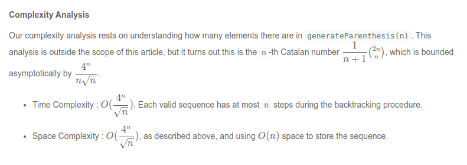

### 28.[Implement strStr()](https://leetcode.com/problems/implement-strstr) :star::star:

Hanfei Original thoughts: no

Correct solution:

KMP baed algorithm

```java
 public int strStr(String txt, String pat) {
        if (pat.length() == 0) {
            return 0;  // return 0 because no pattern to search
        }
        
        int[] lps = computeLPS(pat); // compute LPS array
        
        int i = 0;
        int j = 0;
        while (i < txt.length()) { // loop till text length
            if (txt.charAt(i) == pat.charAt(j)) { // if pattern char matches with text char
                j++;
                i++;
                if (j == pat.length()) { // if pattern length equals to j means we have found one pattern
                    return (i-j);  // index of pattern will be i-j beacause i is at last index of matched pattern 
                }
            } else {
                if (j != 0) {
                    j = lps[j-1]; // try for longest pattern
                } else {
                    i++; // ignore and loop to next char
                } 
            }
            
            
        }
        return -1; // no match found
    }
    
    private int[] computeLPS(String a) {
        int i = 1;
        int j = 0;
        
        int arr[] = new int[a.length()];
        
        while (i < a.length()) {
            if (a.charAt(i) == a.charAt(j)) {
                arr[i++] = ++j;
            } else {
                if (j != 0) {
                    j = arr[j-1];
                } else { 
                    i++;
                }
            }
        }
        return arr;
    }
```

Time O(N) Space O(1)

https://zh.wikipedia.org/wiki/KMP%E7%AE%97%E6%B3%95

solution 2

```java
class Solution {
public int strStr(String f1, String f2) {
int a=f1.length();
int b=f2.length();
if(b==0)
return 0;
for(int i=0;i<a && (i+b)<=a;i+=1)
{
if(f2.equals(f1.substring(i,i+b)))
{
return i;
}
}
return -1;
}
}
```

Time: O(n^2), Space O(1)

The old version substring takes O(1), but new version takes O(n)

solution 3

Java string builder 

```java
class Solution {
    public int strStr(String haystack, String needle) {
        if(haystack.equals(needle))
        {
            return 0;
        }
        StringBuilder sb = new StringBuilder(haystack);
        
        return sb.indexOf(needle);
    }
}
```


### 38.[Count and Say](https://leetcode.com/problems/count-and-say) :star2: :star::star:

Hanfei Original thoughts: None

Correct solution

- Dynamic programming

```java
public String countAndSay(int n) {
    String[] dynamicArray = new String[n];

    dynamicArray[0] = "1";
    for(int i = 1; i < n; i++) {
        dynamicArray[i] = splitDigitString(dynamicArray[i-1]);
    }

    return dynamicArray[n-1];
}

public String splitDigitString(String digitString) {
    int i = 1;
    StringBuilder ans = new StringBuilder();
    char prev = digitString.charAt(0);
    char curr;
    int count = 1;

    while(true) {

        if(i >= digitString.length()) {
            ans.append(count);
            ans.append(prev);
            break;
        }

        curr = digitString.charAt(i);

        if(curr == prev) {
            count++;
        } else {
            ans.append(count);
            ans.append(prev);
            count = 1;
            prev = curr;
        }

        i++;
    }

    return ans.toString();
}
```

Time O(N^2)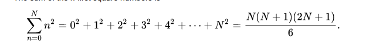

Space O(N)


Improved solution

```java
class Solution {
private StringBuilder sb = new StringBuilder();

public String countAndSay(int n) {
    if(n==1) return "1";
	String str = "11";
    for (int i = 2; i<n; i++) {
      str = process(str);  
    }
    return str;
 }
 


private String process(String str){
	 this.sb.setLength(0);
     char[] seq = str.toCharArray();
     char lastchar = seq[0];
     int counter = 1;
     for(int i=1; i<seq.length; i++){
    	 char current = seq[i];
    	 if (current == lastchar){
    		 counter++;
    	 } else {
    		 this.sb.append(counter).append(lastchar);
    		 lastchar = current;
    		 counter = 1;
    	 }
     }
     this.sb.append(counter).append(lastchar);
     return sb.toString();
}
}


```

Time O(N)

Space O(N)

### 43.[ Multiply Strings](https://leetcode.com/problems/multiply-strings) :star::star:

Hanfei Original thoughts: 

Covert to int linked list => compute result with carry

Deficiency: multiple level of intermediate result

Correct solution:

```java
class Solution {
    public String multiply(String num1, String num2) {
        if (num1.equals("0") || num2.equals("0")) {
            return "0";
        }
        
        StringBuilder firstNumber = new StringBuilder(num1);
        StringBuilder secondNumber = new StringBuilder(num2);
        
        // Reverse both the numbers.
        firstNumber.reverse();
        secondNumber.reverse();
        
        // To store the multiplication result of each digit of secondNumber with firstNumber.
        int N = firstNumber.length() + secondNumber.length();
        StringBuilder answer = new StringBuilder();
        for (int i = 0; i < N; ++i) {
            answer.append(0);
        }
        
        for (int place2 = 0; place2 < secondNumber.length(); place2++) {
            int digit2 = secondNumber.charAt(place2) - '0';
            
            // For each digit in secondNumber multiply the digit by all digits in firstNumber.
            for (int place1 = 0; place1 < firstNumber.length(); place1++) {
                int digit1 = firstNumber.charAt(place1) - '0';
                
                // The number of zeros from multiplying to digits depends on the 
                // place of digit2 in secondNumber and the place of the digit1 in firstNumber.
                int currentPos = place1 + place2;
                
                // The digit currently at position currentPos in the answer string
                // is carried over and summed with the current result.
                int carry = answer.charAt(currentPos) - '0';
                int multiplication = digit1 * digit2 + carry;
                
                // Set the ones place of the multiplication result.
                answer.setCharAt(currentPos, (char)(multiplication % 10 + '0'));
                
                // Carry the tens place of the multiplication result by 
                // adding it to the next position in the answer array.
                int value = (answer.charAt(currentPos + 1) - '0') + multiplication / 10;
                answer.setCharAt(currentPos + 1, (char)(value + '0'));
            }
        }
        
        // Pop excess 0 from the rear of answer.
        if (answer.charAt(answer.length() - 1) == '0') {
            answer.deleteCharAt(answer.length() - 1);
        }
        
        answer.reverse();
        return answer.toString();
    }
}
```

Time O(M * N)

Space O(M + N)

### 49.[Group Anagrams](https://leetcode.com/problems/group-anagrams) :star::star:

Hanfei Original thoughts:

sort each string => put in map => iterate each string and group together

O(N kLogk)


Improved solution:

encode string

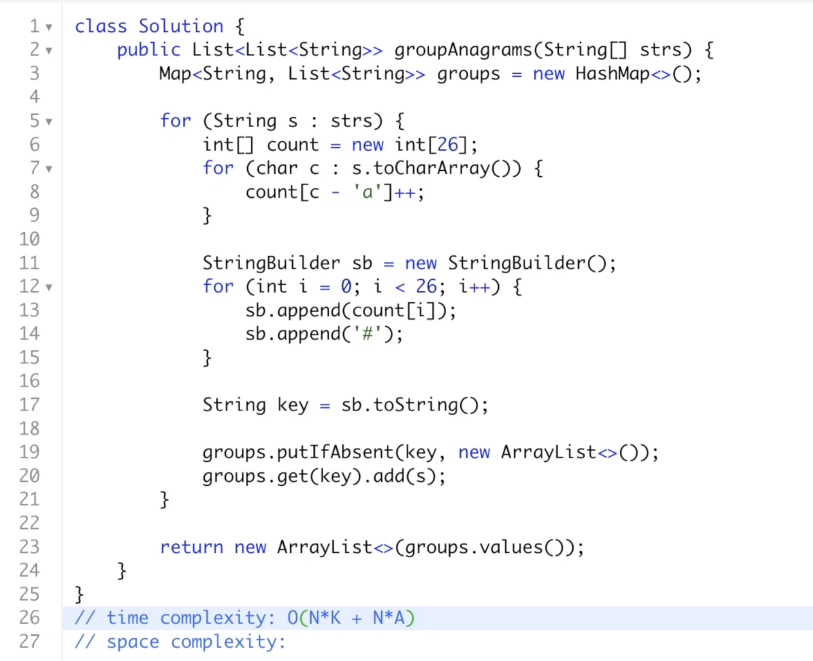

```java
class Solution {
    public List<List<String>> groupAnagrams(String[] strs) {
        if (strs.length == 0) return new ArrayList();
        Map<String, List> ans = new HashMap<String, List>();
        int[] count = new int[26];
        for (String s : strs) {
            Arrays.fill(count, 0);
            for (char c : s.toCharArray()) count[c - 'a']++;

            StringBuilder sb = new StringBuilder("");
            for (int i = 0; i < 26; i++) {
                sb.append('#');
                sb.append(count[i]);
            }
            String key = sb.toString();
            if (!ans.containsKey(key)) ans.put(key, new ArrayList());
            ans.get(key).add(s);
        }
        return new ArrayList(ans.values());
    }
}
```

Time O(NK) Space O(NK)

### 58.[Length of Last Word](https://leetcode.com/problems/length-of-last-word)

Hanfei Original thoughts: String function split

```java
class Solution {
    public int lengthOfLastWord(String s) {
        String [] arr = s.split(" ");
        
        return arr[arr.length - 1].length();
    }
}
```

Time O(N), Space O(N)

one pass solution:

```
class Solution {
    public int lengthOfLastWord(String s) {
        int p = s.length(), length = 0;
        while (p > 0) {
            p--;
            // we're in the middle of the last word
            if (s.charAt(p) != ' ') {
                length++;
            }
            // here is the end of last word
            else if (length > 0) {
                return length;
            }
        }
        return length;
  }
}
```

Time: O(N) Space O(1)

### 67.[Add Binary](https://leetcode.com/problems/add-binary)

Hanfei Original thoughts: convert to list sum problem

```java
class Solution {
    public String addBinary(String a, String b) {
        StringBuilder sb = new StringBuilder();
        int i = a.length() - 1, j = b.length() -1, carry = 0;
        while (i >= 0 || j >= 0) {
            int sum = carry;
            if (j >= 0) sum += b.charAt(j--) - '0';
            if (i >= 0) sum += a.charAt(i--) - '0';
            sb.append(sum % 2);
            carry = sum / 2;
        }
        if (carry != 0) sb.append(carry);
        return sb.reverse().toString();
    }
}
```

Time Space O(N)

### 71.[Simplify Path](https://leetcode.com/problems/simplify-path) :star_and_crescent :star:(half) ​

Hanfei Original thoughts: using stack

Correct solution:

```java
class Solution {
    public String simplifyPath(String path) {

        // Initialize a stack
        Stack<String> stack = new Stack<String>();
        String[] components = path.split("/");

        // Split the input string on "/" as the delimiter
        // and process each portion one by one
        for (String directory : components) {

            // A no-op for a "." or an empty string
            if (directory.equals(".") || directory.isEmpty()) {
                continue;
            } else if (directory.equals("..")) {

                // If the current component is a "..", then
                // we pop an entry from the stack if it's non-empty
                if (!stack.isEmpty()) {
                    stack.pop();
                }
            } else {

                // Finally, a legitimate directory name, so we add it
                // to our stack
                stack.add(directory);
            }
        }

        // Stich together all the directory names together
        StringBuilder result = new StringBuilder();
        for (String dir : stack) {
            result.append("/");
            result.append(dir);
        }

        return result.length() > 0 ? result.toString() : "/" ;
    }
}
```

Time & Space = O(N)

### 91.[ Decode Ways](https://leetcode.com/problems/decode-ways) :star: :star:

Hanfei Original thoughts: sliding window / DP

> Links to DP: https://www.youtube.com/watch?v=vYquumk4nWw

Correct solution (Good DP problem)

```java
class Solution {

    public int numDecodings(String s) {
        // DP array to store the subproblem results
        int[] dp = new int[s.length() + 1];
        dp[0] = 1;
        
        // Ways to decode a string of size 1 is 1. Unless the string is '0'.
        // '0' doesn't have a single digit decode.
        dp[1] = s.charAt(0) == '0' ? 0 : 1;

        for(int i = 2; i < dp.length; i++) {
            // Check if successful single digit decode is possible.
            if (s.charAt(i - 1) != '0') {
               dp[i] = dp[i - 1];  
            }
            
            // Check if successful two digit decode is possible.
            int twoDigit = Integer.valueOf(s.substring(i - 2, i));
            if (twoDigit >= 10 && twoDigit <= 26) {
                dp[i] += dp[i - 2];
            }
        }
        
        return dp[s.length()];
    }
}
```

Time & Space = O(N)

Improved solution:


```java
   class Solution {
    public int numDecodings(String s) {  
        if (s.charAt(0) == '0') {
            return 0;
        }
    int n = s.length();
    int twoBack = 1;
    int oneBack = 1;
    for (int i = 1; i < n; i++) {
        int current = 0;
        if (s.charAt(i) != '0') {
            current = oneBack;
        }
        int twoDigit = Integer.parseInt(s.substring(i - 1, i + 1));
        if (twoDigit >= 10 && twoDigit <= 26) {
            current += twoBack;
        }
       
        twoBack = oneBack;
        oneBack = current;
    }
    return oneBack;
}
}
```

Time = O(N)

Space = O(1)

### 93.[Restore IP Addresses](https://leetcode.com/problems/restore-ip-addresses) :star::star: ​

Hanfei original thoughts: Looks like a backtrack problem

Correct solution

```java
class Solution {
    List<String> res = new ArrayList<>();
public List<String> restoreIpAddresses(String s) {
	backtrack(0, 0, new StringBuilder(), s);
	return res;
}

private void backtrack(int count, int curIndex, StringBuilder sb, String s) {
	if(count == 4 && curIndex == s.length()) {
		res.add(sb.toString());
		return;
	} else if(count == 4) {
		return;
	}

	// Assuming IP address is potentially 3 length string
	for(int i=1; i<=3; i++) {
		// If current index is overflowed length of s string
		if(curIndex + i > s.length()) {
			continue;
		}
		String candidate = s.substring(curIndex, curIndex + i);
		// Validating if IP address candidate is any string 0 to 255 properly
		if(!valid(candidate)) {
			continue;
		}

		if(sb.length() > 0) {
			sb.append(".");
		}
		sb.append(candidate);

		backtrack(count + 1, curIndex + i, sb, s);

		// Remove last added string of candidate IP address
		for(int j=0; j<candidate.length(); j++){
			sb.deleteCharAt(sb.length()-1);
		}
		if(sb.length() > 0) {
			sb.deleteCharAt(sb.length()-1);
		}
	}
}

public boolean valid(String segment) {
	int m = segment.length();
	if (m > 3)
	  return false;
	return (segment.charAt(0) != '0') ? (Integer.valueOf(segment) <= 255) : (m == 1);
}
}
```

- Time complexity : as discussed above, there is not more than `27` combinations to check.
- Space complexity : constant space to keep the solutions, not more than `19` valid IP addresses.

### 97.[ Interleaving String](https://leetcode.com/problems/interleaving-string) :star::star: :star:


Correct solution: (DP)

```java
public class Solution {
    public boolean isInterleave(String s1, String s2, String s3) {
        if (s3.length() != s1.length() + s2.length()) {
            return false;
        }
        boolean dp[] = new boolean[s2.length() + 1];
        for (int i = 0; i <= s1.length(); i++) {
            for (int j = 0; j <= s2.length(); j++) {
                if (i == 0 && j == 0) {
                    dp[j] = true;
                } else if (i == 0) {
                    dp[j] = dp[j - 1] && s2.charAt(j - 1) == s3.charAt(i + j - 1);
                } else if (j == 0) {
                    dp[j] = dp[j] && s1.charAt(i - 1) == s3.charAt(i + j - 1);
                } else {
                    dp[j] = (dp[j] && s1.charAt(i - 1) == s3.charAt(i + j - 1)) || (dp[j - 1] && s2.charAt(j - 1) == s3.charAt(i + j - 1));
                }
            }
        }
        return dp[s2.length()];
    }
}
```

Time O(m * n)

Space O(n)

## 10-11 ~ 10-17

---

Most Frequent problem

---


### [42. Trapping Rain Water](https://leetcode.com/problems/trapping-rain-water) :star::star: :star:


Correct solution

Two pointer

```java
class Solution {
    public int trap(int[] nums) {
        
        int lo = 0, hi = nums.length-1, res = 0;
        int leftMax = 0, rightMax = 0;
        
        while(lo <= hi){
            if(nums[lo] <= nums[hi]){
                
                if(nums[lo] > leftMax) leftMax = nums[lo];
                
                else res += leftMax - nums[lo];
                
                lo++;
            }
            else{
                if(nums[hi] > rightMax)
                    rightMax = nums[hi];
                else
                    res += rightMax - nums[hi];
                
                hi--;
            }
        }
        return res;
    }
}
```

Time O(N) Space O(1)


### [1041. Robot Bounded In Circle](https://leetcode.com/problems/robot-bounded-in-circle)

```java
class Solution {
    public boolean isRobotBounded(String instructions) {
        // north = 0, east = 1, south = 2, west = 3
        int[][] directions = new int[][]{{0, 1}, {1, 0}, {0, -1}, {-1, 0}};
        // Initial position is in the center
        int x = 0, y = 0;
        // facing north
        int idx = 0;
        
        for (char i : instructions.toCharArray()) {
            if (i == 'L')
                idx = (idx + 3) % 4;
            else if (i == 'R')
                idx = (idx + 1) % 4;
            else {
                x += directions[idx][0];
                y += directions[idx][1];   
            }    
        }
        
        // after one cycle:
        // robot returns into initial position
        // or robot doesn't face north
        return (x == 0 && y == 0) || (idx != 0);
    }
}
```

Time O(N) Space O(1)

### [1235. Maximum Profit in Job Scheduling](https://leetcode.com/problems/maximum-profit-in-job-scheduling)

Hanfei Original thoughts: back track

## 12-11

### [253. Meeting Rooms II](https://leetcode.com/problems/meeting-rooms-ii/)

Thoughts:

1. Sort the given meetings by their start time
2. Initialise a new min-heap and add the first meeting's ending, simply keep track of the ending times which indicates when a meeting room will be free
3. For every meeting room, check if the top element of meeting room is free
4. If its free, then extract the top element and replace with current meeting
5. If not, then we allocate a new meeting room
6. After processing all meetings, the size of the heap will tell us the number of rooms allocated.


```java
class Solution {
    public int minMeetingRooms(int[][] intervals) {
        
    // Check for the base case. If there are no intervals, return 0
    if (intervals.length == 0) {
      return 0;
    }

    // Min heap
    PriorityQueue<Integer> allocator =
        new PriorityQueue<Integer>(
            intervals.length,
            new Comparator<Integer>() {
              public int compare(Integer a, Integer b) {
                return a - b;
              }
            });

    // Sort the intervals by start time
    Arrays.sort(
        intervals,
        new Comparator<int[]>() {
          public int compare(final int[] a, final int[] b) {
            return a[0] - b[0];
          }
        });

    // Add the first meeting
    allocator.add(intervals[0][1]);

    // Iterate over remaining intervals
    for (int i = 1; i < intervals.length; i++) {

      // If the room due to free up the earliest is free, assign that room to this meeting.
      if (intervals[i][0] >= allocator.peek()) {
        allocator.poll();
      }

      // If a new room is to be assigned, then also we add to the heap,
      // If an old room is allocated, then also we have to add to the heap with updated end time.
      allocator.add(intervals[i][1]);
    }

    // The size of the heap tells us the minimum rooms required for all the meetings.
    return allocator.size();
  }
}
```


## 12-18

### [68. Text Justification](https://leetcode.com/problems/text-justification/)

Difficulty point:

1. Text need to be fully justified
2. Last line of text should be left justified


Dynamic programming video explanation: https://www.youtube.com/watch?v=RORuwHiblPc

Code explanation: https://www.youtube.com/watch?v=GqXlEbFVTXY


 
